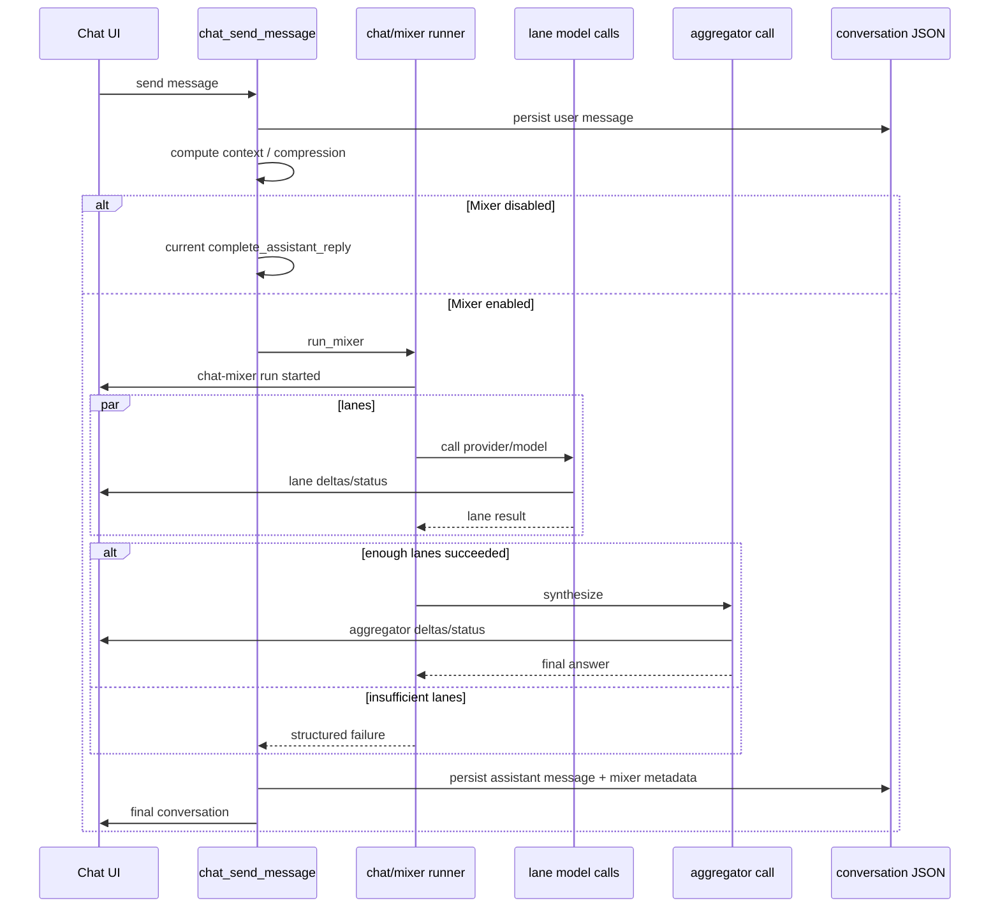

# Chat Mixer Feature PRD

## Goal

Add a Chat "Mixer" mode to Kivio: users can send one prompt to multiple selected models in parallel, inspect each model's answer, and optionally receive a synthesized final answer from an aggregator model. The feature should help users compare model perspectives, improve answers on hard tasks, and keep Kivio's existing lightweight Chat experience intact.

## Product Framing

The name "Mixer" should mean a conversation-level multi-model answer workflow, not an audio mixer and not only Hermes-style background auxiliary model routing.

Hermes Agent provides two relevant references:

- **Auxiliary model slots**: per-task model assignments such as vision, compression, and title generation. Useful for Kivio settings design and failure isolation.
- **Mixture-of-Agents tool**: parallel reference model calls followed by aggregator synthesis. This is the closest behavior match for Kivio Mixer.

## What I Already Know

- Kivio Chat already supports model providers, provider API formats, failover API keys, streaming, reasoning, skills, MCP/native tools, attachments, context compression, projects, and assistants.
- `src-tauri/src/chat/agent/` now contains a reusable agent runtime for a single model/provider run.
- `src/chat/Chat.tsx` already has stream snapshot handling and Tauri event listeners for `chat-stream`, `chat-tool`, and `chat-context`.
- `src/chat/InputBar.tsx` already has a tool/settings affordance that can host a Mixer toggle/config entry.
- Hermes Auxiliary uses per-task `provider/model/base_url/api_key/timeout/extra_body` slots, with `auto` fallback and UI reset/change flows.
- Hermes MoA queries reference models in parallel, tolerates partial failures, and synthesizes successful responses through an aggregator model.
- A local Hermes auxiliary invocation was attempted and reached the auxiliary route, but failed with HTTP 401 due to the configured local provider key. This reinforces the need for lane-level failure isolation.

## Assumptions

- Mixer MVP is for the Chat window only.
- MVP does not expose Mixer in Lens, screenshot translation, text translation, or global shortcut flows.
- MVP can ship without tools in mixer lanes. Normal Chat tools remain available when Mixer is off.
- MVP persists all lane outputs and the synthesized answer in the conversation JSON.
- "auto" for aggregator means use the conversation's current provider/model unless the user overrides it.

## Target Users

- Users who compare multiple models before trusting an answer.
- Users doing coding, writing, translation, research planning, and reasoning-heavy work.
- Users who already configured multiple providers in Kivio settings.

## User Experience

### Entry Points

- Chat composer: add a compact Mixer control near the existing tools/settings controls.
- Chat top bar or model selector: expose Mixer status when enabled for the current conversation.
- Settings: add a Mixer section for default lanes, aggregator, timeout, and synthesis behavior.

### Core Flow

1. User enables Mixer in Chat.
2. User sends a prompt.
3. Kivio creates one user message as it does today.
4. Kivio starts parallel lane runs for selected models.
5. UI shows each lane as a named strip/card with status:
   - queued
   - running
   - completed
   - failed
   - cancelled
6. If enough lanes succeed, Kivio runs the aggregator model.
7. The assistant message shows:
   - final synthesized answer first, when synthesis is enabled and succeeds
   - collapsible lane responses below
   - clear model/provider provenance
8. If synthesis is disabled, the assistant message shows lane responses as the primary output.

### Composer Behavior

- The send button behaves normally.
- Cancellation cancels all active lane runs and aggregator run.
- While Mixer is running, the composer remains locked like current streaming.
- Attachments are allowed only when all enabled lanes support the attachment type, or the UI disables unsupported lanes before send.

### Message Rendering

Assistant message layout:

- Header: "Mixer" badge, total duration, success count.
- Final answer area:
  - synthesized answer if available
  - fallback text if synthesis did not run
- Lane panel:
  - model/provider label
  - status and duration
  - reasoning indicator if available
  - answer content
  - error message if failed

The final answer should not hide lane failures. Failures can be compact, but visible.

## Functional Requirements

### M1. Mixer Settings

Add persistent settings for Chat Mixer:

```ts
type ChatMixerConfig = {
  enabled: boolean
  defaultEnabled: boolean
  lanes: ChatMixerLaneConfig[]
  aggregator: ChatMixerAggregatorConfig
  minSuccessfulLanes: number
  laneTimeoutMs: number
  maxLaneOutputChars: number
  streamLanes: boolean
  synthesize: boolean
}

type ChatMixerLaneConfig = {
  id: string
  enabled: boolean
  label: string
  providerId: string
  model: string
  temperature?: number | null
}

type ChatMixerAggregatorConfig = {
  providerId: string // empty means inherit conversation model
  model: string
  temperature?: number | null
}
```

Defaults:

- `enabled: false`
- `defaultEnabled: false`
- `lanes: []`
- `synthesize: true`
- `minSuccessfulLanes: 1`
- `laneTimeoutMs: 120000`
- `maxLaneOutputChars: 24000`
- `streamLanes: true`
- aggregator inherits current conversation model when unset.

Validation:

- Clamp lane count to 2-6 for MVP.
- Clamp timeout to 15s-300s.
- Clamp `minSuccessfulLanes` to `1..enabledLaneCount`.
- Remove lanes referencing disabled or deleted providers during settings sanitization.

### M2. Mixer Run Command

Extend `chat_send_message` behavior:

- If Mixer is off, preserve current behavior exactly.
- If Mixer is on, call a new mixer orchestration path after persisting the user message and context state.

Recommended backend shape:

- `chat/mixer/types.rs`
- `chat/mixer/runner.rs`
- `chat/mixer/prompt.rs`
- `chat/mixer/mod.rs`

The mixer runner should reuse current provider/model abstractions from `src-tauri/src/chat/model/`.

### M3. Lane Execution

Each lane receives:

- Same system prompt as normal Chat, with an additional short lane instruction.
- Same user-visible conversation context.
- Same latest user content and supported attachments.

MVP constraints:

- No tools exposed to lane model calls.
- No MCP/native tool execution inside lanes.
- No approvals inside lanes.
- Skills may be prompt-injected if active, but skill runtime tools are disabled.

Lane execution must:

- Run lanes concurrently.
- Respect cancellation.
- Respect per-lane timeout.
- Capture content, reasoning, provider/model, duration, token usage if available.
- Return a structured failure for provider/auth/rate-limit/context errors.

### M4. Aggregator Synthesis

When `synthesize` is true and successful lanes meet `minSuccessfulLanes`, run aggregator synthesis.

Aggregator prompt should include:

- Original user request.
- Brief system instruction to synthesize, verify, and not blindly copy.
- Enumerated lane responses with provider/model labels.
- Any failed lane summary as provenance, not as source content.

Suggested aggregator system instruction:

```text
You are synthesizing multiple model responses into one final answer. Compare the responses critically, preserve correct details, resolve conflicts, remove duplication, and produce the best answer for the user's original request. Do not mention unavailable information unless it affects the answer. If responses disagree, explain the resolution briefly.
```

Aggregator behavior:

- If aggregator fails, persist lane responses and show a visible synthesis failure.
- If all lanes fail, do not call aggregator.
- If only one lane succeeds, aggregator may still run when enabled, but UI should disclose "1 lane succeeded".

### M5. Streaming Events

Add a new event instead of overloading `chat-stream` too heavily:

`chat-mixer`

Payload:

```ts
type ChatMixerEvent = {
  conversationId: string
  runId: string
  messageId: string
  mixerRunId: string
  kind: 'run' | 'lane' | 'aggregator'
  laneId?: string
  providerId?: string
  model?: string
  status?: 'queued' | 'running' | 'completed' | 'failed' | 'cancelled'
  delta?: string
  reasoningDelta?: string
  full?: string
  error?: string
  startedAt?: number
  completedAt?: number
  durationMs?: number
}
```

Use existing `chat-stream` only for the final synthesized assistant answer if that keeps UI integration simpler. Otherwise, `chat-mixer` can fully drive the Mixer preview.

### M6. Persistence

Extend `ChatMessage` with mixer metadata:

```ts
type ChatMixerRunRecord = {
  id: string
  enabled: boolean
  synthesized: boolean
  minSuccessfulLanes: number
  startedAt: number
  completedAt?: number
  durationMs?: number
  lanes: ChatMixerLaneRecord[]
  aggregator?: ChatMixerAggregatorRecord | null
}

type ChatMixerLaneRecord = {
  id: string
  label: string
  providerId: string
  providerName?: string
  model: string
  status: 'completed' | 'failed' | 'cancelled'
  content?: string
  reasoning?: string
  error?: string
  durationMs?: number
}

type ChatMixerAggregatorRecord = {
  providerId: string
  providerName?: string
  model: string
  status: 'completed' | 'failed' | 'skipped'
  content?: string
  reasoning?: string
  error?: string
  durationMs?: number
}
```

Rust storage uses snake_case. Frontend may accept both snake_case and camelCase during migration.

### M7. Conversation and Assistant Integration

Conversation:

- Store the effective mixer state used for the assistant response.
- Existing conversation `provider_id` and `model` remain the primary/default model.

Assistant Center:

- P1: assistants can optionally define a mixer preset.
- MVP: assistants inherit global/current mixer settings.

Projects:

- No special project behavior in MVP.

### M8. Settings UI

Add Chat settings controls:

- Mixer master toggle.
- Default enabled for new chats toggle.
- Lane list:
  - add lane
  - remove lane
  - provider/model picker
  - enabled toggle
  - label input
- Aggregator model selector:
  - inherit current model
  - choose provider/model
- Synthesis toggle.
- Minimum successful lanes.
- Lane timeout.

Use existing `ModelPairSelect` / provider selector patterns where possible.

### M9. Chat UI

Add a compact Mixer control in composer:

- Off: neutral icon button.
- On: active icon/button with lane count.
- Menu/panel:
  - enable/disable for this conversation/send
  - choose preset/global lanes
  - quick view of selected lane models
  - link to settings

### M10. Error Handling

Required error handling:

- Provider missing API key: fail only that lane.
- Provider/model missing or disabled: block send if configured lane is invalid.
- Rate limit/auth/payment failure: fail that lane; continue if enough lanes succeed.
- Context too large for a lane: fail that lane with a clear message.
- Aggregator failure: show successful lanes and synthesis failure.
- User cancellation: mark all unfinished lanes and aggregator cancelled.

### M11. Cost and Latency Transparency

Mixer can multiply cost. UI must make that visible:

- Show lane count before send.
- Show running status per lane.
- Show approximate or actual usage if available in backend output.
- Warn when more than 3 lanes are enabled.

## Non-Functional Requirements

- Preserve current non-Mixer Chat behavior.
- Keep package size impact minimal; avoid new heavy dependencies.
- Avoid adding a separate LLM SDK just for Mixer.
- Keep backend orchestration testable outside Tauri event emitters.
- Ensure long-running lane calls can be cancelled promptly.
- Do not persist secrets in new places; reuse provider API keys already in `settings.json`.

## Out of Scope for MVP

- Tools/MCP/native tool execution inside mixer lanes.
- Multi-round tool loops per lane.
- Lens/Screenshot Translation Mixer.
- Automated model selection.
- Ranking lanes by quality.
- Cross-conversation benchmark dashboards.
- Sharing/publishing mixer presets.
- Web search as a hidden lane.

## Technical Design Notes

### Recommended Backend Flow



### Reuse Opportunities

- Reuse `ModelProvider` and `ProviderApiFormat`.
- Reuse `chat/model` provider abstraction for lane and aggregator calls.
- Reuse `build_chat_api_messages` where possible, with a mixer-specific system prompt patch.
- Reuse `emit_chat_stream_done` patterns for cancellation and finalization.
- Reuse Chat's existing stream snapshot map pattern but key mixer lanes by `mixerRunId/laneId`.

### Open Implementation Question

Should lane calls support streaming in MVP?

Recommendation: yes for perceived responsiveness, but only stream text deltas and no tools. If implementation complexity is high, ship MVP with lane status + final lane content and stream only the aggregator.

## Acceptance Criteria

- [ ] User can enable Mixer for a Chat send.
- [ ] User can configure 2-6 mixer lanes from enabled providers/models.
- [ ] Sending with Mixer runs lane models concurrently.
- [ ] Lane progress is visible while running.
- [ ] A failed lane does not fail the full run when `minSuccessfulLanes` is met.
- [ ] Aggregator synthesis produces the assistant message content when enabled.
- [ ] Lane outputs and aggregator metadata persist and restore after reload.
- [ ] Cancel stops active lanes and aggregator.
- [ ] Non-Mixer Chat behavior remains unchanged.
- [ ] Invalid mixer settings are sanitized or blocked with clear UI messages.
- [ ] `npm run lint`, `npm run typecheck`, and `cargo test --manifest-path src-tauri/Cargo.toml` pass for implementation PRs.

## Suggested Milestones

### Phase 1: Data and Settings

- Add `ChatMixerConfig` to settings.
- Add sanitization/defaults.
- Add Settings UI for lanes and aggregator.
- Add frontend/Rust types.

### Phase 2: Backend Runner

- Add `chat/mixer` module.
- Implement non-tool lane execution.
- Implement cancellation and timeout.
- Persist mixer metadata.

### Phase 3: Streaming UI

- Add `chat-mixer` event.
- Render live lane statuses and deltas.
- Render persisted mixer lane panels in assistant messages.

### Phase 4: Aggregator

- Add synthesis prompt and aggregator run.
- Support aggregator inherit/override.
- Handle partial failure and synthesis fallback.

### Phase 5: Polish and Guardrails

- Cost/latency warning.
- Attachment capability validation.
- Assistant preset support if needed.
- Tests and manual smoke checks.

## Risks

| Risk | Impact | Mitigation |
|---|---|---|
| Cost unexpectedly high | User distrust / surprise bills | Lane count indicator, warning over 3 lanes, default off |
| Slow runs | Bad UX | Parallel lanes, per-lane timeout, cancel |
| Provider failures | Full answer failure | Per-lane failure isolation and `minSuccessfulLanes` |
| Tool-state explosion | Complex bugs | No tools in MVP lanes |
| Context too large for smaller lane models | Lane failures | Preflight context estimate where possible; clear lane error |
| UI clutter | Chat becomes noisy | Final answer first, lane panel collapsed by default |

## Research References

- [`research/hermes-auxiliary-and-kivio-analysis.md`](research/hermes-auxiliary-and-kivio-analysis.md) — local Hermes Auxiliary/MoA analysis and Kivio architecture mapping.

## Definition of Done

- PRD is reviewed and accepted.
- Implementation task can begin from this PRD without re-discovering Hermes Auxiliary or Kivio Chat architecture.
- Any later implementation PR keeps non-Mixer Chat behavior unchanged and includes lint/typecheck/Rust test results.
