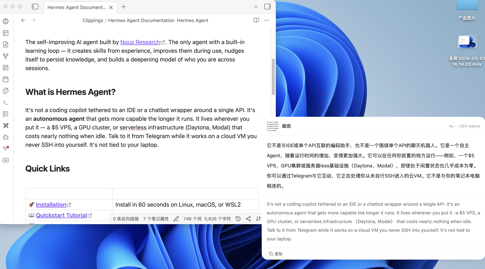
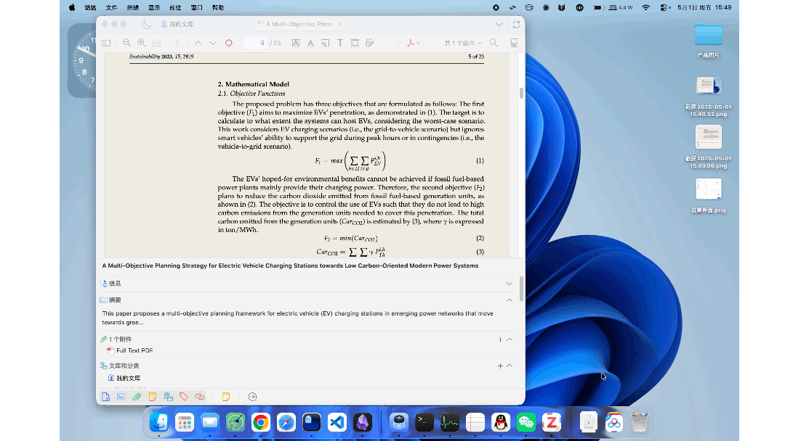
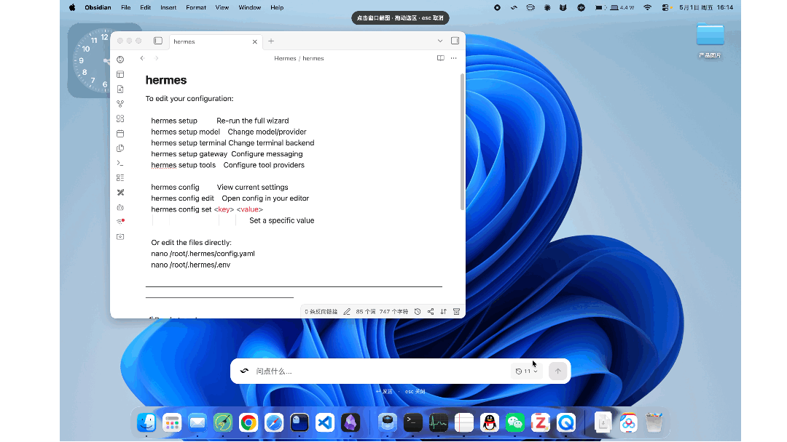
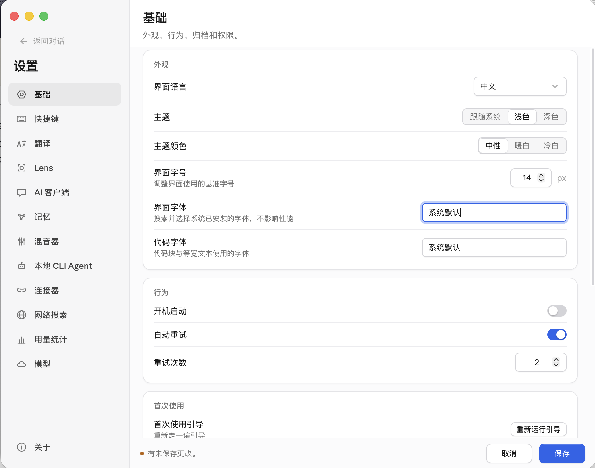

<p align="center">
  
</p>

<h1 align="center">Kivio</h1>

<p align="center">
  <strong>Screen-level AI assistant — translate, capture, ask, all from a global hotkey.</strong>
</p>

<p align="center">
  <a href="https://github.com/ZMGID/kivio/releases/latest"></a>
  
  
  
</p>

<p align="center">
  <a href="https://github.com/ZMGID/kivio/releases/latest"><strong>Download</strong></a>
  &nbsp;·&nbsp;
  <a href="#中文">中文</a>
</p>

---

## What it does

Kivio lives quietly in your menu bar. Press a hotkey, get answers about anything on screen.

- 🌐 **Translate as you type** — instant inline translation, hit Enter to paste it back where you were.
- 📸 **Screenshot translate** — capture any window or region; the translated card flies to where you selected, with the original text right below for reference.
- 🔍 **Ask a screenshot anything** — Lens captures what you point at and lets you have a multi-turn conversation about it. Per-image history, streamed answers, optional reasoning chain.

Designed to stay out of the way: small bundle, low memory, never steals focus.

### Screenshot translation

<p align="center">
  
</p>

Capture any window or region — the translated card flies to where you selected, with the original text right below for reference.

### Lens — ask anything about your screen

<p align="center">
  
</p>

Capture a formula, a diagram, or a wall of text — have a multi-turn conversation about it. Per-image history, streamed answers, optional reasoning chain.

<p align="center">
  
  <br>
  <sub>Capture text and ask AI to optimize or translate it on the spot</sub>
</p>

### Settings

<p align="center">
  
</p>

## Hotkeys

| Action | macOS | Windows |
|---|---|---|
| Translator | `⌘⌥T` | `Ctrl+Alt+T` |
| Screenshot translate | `⌘⇧A` | `Ctrl+Shift+A` |
| Lens (capture & ask) | `⌘⇧G` | `Ctrl+Shift+G` |

All remappable in Settings.

## Quick start

1. **[Download the latest release](https://github.com/ZMGID/kivio/releases/latest)** (DMG for macOS, MSI / NSIS for Windows).
2. **Install and launch.** On macOS, grant Accessibility + Screen Recording when prompted (System Settings → Privacy & Security).
   > **macOS note:** If you see "Kivio.app is damaged and can't be opened", it's Gatekeeper blocking the unsigned app. Run this in Terminal and reopen:
   > ```bash
   > sudo xattr -rd com.apple.quarantine /Applications/Kivio.app
   > ```
3. **Add your API key** — Settings → Providers. Works with OpenAI, DeepSeek, SiliconFlow, Ollama Cloud, or any OpenAI-compatible endpoint.
4. **Hit a hotkey.** That's it.

## Why pick this

- **Vision is first-class.** Lens isn't a tacked-on extra — same workflow, same window, same hotkey muscle memory.
- **Bring your own model.** Different provider per feature (cheap one for translate, capable one for vision). Mix OpenAI, DeepSeek, Ollama, anything that speaks the OpenAI API.
- **Multiple keys per provider.** Pool 3 API keys, the app rotates automatically when one hits a 429 or runs out of quota.
- **Quiet by default.** Auto-update notifies you, doesn't pull you out of work. No analytics, no telemetry.
- **It's small.** ~10 MB install. Idle memory hovers around 50 MB.

## Settings

Open from the menu bar icon. The important bits:

- **Providers** — multi-provider, multi-key, with a one-click test-connection.
- **Per-feature routing** — translate / screenshot OCR / Lens each pick their own model.
- **Prompts** — every feature has an editable template with `{lang}` and `{text}` placeholders.
- **Streaming + reasoning** — togglable per feature; off by default for screenshot translate (speed wins).

## Upgrading from KeyLingo

If you ran v2.4.4 or earlier under the old name **KeyLingo**, your settings, API keys, and Lens history are migrated automatically the first time Kivio launches — nothing to do. The legacy `KeyLingo.app` in `/Applications` can be safely deleted; it won't be auto-removed because macOS treats the renamed bundle as a different app.

## Changelog

- **v2.5.0** — Screenshot auto-archive: every capture is automatically copied to a user-defined directory with a timestamped filename (`kivio-YYYY-MM-DD-HHMMSS-{uuid}.png`). Lens default prompts reworked — the assistant is no longer framed as an "image analyzer"; it treats screenshots as visual context for any conversation (extraction, explanation, assistance, etc.). Added Traditional Chinese (zh-Hant) language support. Fixed history dropdown being covered by the answer area.
- **v2.4.7** — Fixed app icon squircle corners not appearing on macOS / Windows (the rounded mask was clipping transparent padding instead of the white background). Replaced the Aperture placeholder in the Lens input bar with the actual Kivio logo mark; generalized the placeholder text from "ask about this screenshot" to "ask anything". Fixed Lens answer panel appearing below screen when submitting without a capture while "keep fullscreen overlay" is off.
- **v2.4.6** — Renamed to **Kivio** (was KeyLingo) — the project outgrew the "key + lingo" framing once Lens turned it into a screen-level AI assistant. New squircle app icon and a dedicated black template-image tray icon (auto-tinted for light/dark menubar). Settings UI redesigned with system-style depth, one shared accent color, and per-provider status indicators. One-time migration moves all KeyLingo data (settings.json, API keys, Lens history) into the new app data directory — existing users upgrade with zero data loss.
- **v2.4.5** — In-app updates on macOS no longer leave the new app stuck behind Gatekeeper — quarantine attribute is stripped automatically after install, no more manual `xattr` command between versions. Also fixes mount-point parsing on second install attempt.
- **v2.4.4** — One-click provider presets (DeepSeek, OpenRouter, SiliconFlow, GLM, Ollama). On macOS 26+ Apple Silicon, Apple Intelligence shows up as a zero-config provider — uses the on-device Foundation Models for translation. Screenshot translation gains a "use system OCR" toggle that pairs Apple Vision (free, on-device) with any text-only translator.
- **v2.4.2** — Floating Lens mode now stops flickering when the bar lands at the target. Screenshot translation gets its own "keep fullscreen" toggle and a tailored fade-in (no fake fly). Updates can be downloaded and installed in-app — no more bouncing to the GitHub release page.
- **v2.4.1** — Fixes Lens input focus on Windows after an answer completes and removes the heavy shadow halo around the floating Lens bar.

See [GitHub Releases](https://github.com/ZMGID/kivio/releases) for the full history. Auto-update checks for new versions on launch and points you here.

## Development

Built with Tauri v2 + React 18 + TailwindCSS v4.

```bash
npm install
npm run dev   # full Tauri app (Rust backend + Vite UI)
```

PRs welcome. See `CLAUDE.md` and `AGENTS.md` for architecture notes.

## License

MIT © ZM

## Friends

- [LINUX DO](https://linux.do)

---

<a name="中文"></a>

<h1 align="center">Kivio · 中文</h1>

<p align="center">
  <strong>屏幕级 AI 助手 —— 翻译、截图、问问题，一个全局热键全搞定。</strong>
</p>

<p align="center">
  <a href="https://github.com/ZMGID/kivio/releases/latest"><strong>下载</strong></a>
  &nbsp;·&nbsp;
  <a href="#kivio">English</a>
</p>

---

## 它能做什么

Kivio 常驻菜单栏。按下热键，AI 就来处理你屏幕上的任何东西。

- 🌐 **边打字边翻译** —— 即时翻译，回车把结果粘回你刚才的应用
- 📸 **截图翻译** —— 截任意窗口或选区，译文浮窗飞到你选的位置，原文紧跟在下作参考
- 🔍 **对截图提问** —— Lens 截下你指的东西，多轮对话问它任何问题。每张图独立历史、流式回答、可选思维链

不抢焦点、不弹大窗、安装包小、内存占用低。

### 截图翻译

<p align="center">
  
</p>

截任意窗口或选区，译文浮窗飞到你选的位置，原文紧跟在下作参考。

### Lens — 对屏幕上的内容提问

<p align="center">
  
</p>

截下公式、图表或大段文字，跟它多轮对话。每张图独立历史、流式回答、可选思维链。

<p align="center">
  
  <br>
  <sub>截取文字，让 AI 当场优化或翻译</sub>
</p>

### 设置面板

<p align="center">
  
</p>

## 热键

| 功能 | macOS | Windows |
|---|---|---|
| 翻译 | `⌘⌥T` | `Ctrl+Alt+T` |
| 截图翻译 | `⌘⇧A` | `Ctrl+Shift+A` |
| Lens（截图问答） | `⌘⇧G` | `Ctrl+Shift+G` |

热键全部可在设置中重绑。

## 快速上手

1. **[下载最新版](https://github.com/ZMGID/kivio/releases/latest)**（macOS 选 DMG，Windows 选 MSI 或 NSIS）
2. **安装并启动**。macOS 首次启动按提示授予辅助功能 + 屏幕录制权限（系统设置 → 隐私与安全性）
   > **macOS 提示：** 如果弹出「Kivio.app 已损坏，无法打开」，这是 Gatekeeper 拦截了未签名应用。在终端执行以下命令后重新打开即可：
   > ```bash
   > sudo xattr -rd com.apple.quarantine /Applications/Kivio.app
   > ```
3. **配置 API Key** —— 设置 → 服务商。支持 OpenAI、DeepSeek、SiliconFlow、Ollama Cloud，以及任何 OpenAI 兼容接口
4. **按热键**。就这样

## 为什么选它

- **视觉问答是核心，不是配菜**。Lens 跟翻译共用同一套交互、同一个窗口、同一种肌肉记忆
- **模型你自己挑**。每个功能可选不同服务商（翻译用便宜的，视觉用强的）。OpenAI、DeepSeek、Ollama 都行，OpenAI 兼容的都通
- **每个服务商多 Key 自动切换**。配 3 个 Key，主 Key 限流或额度耗尽就自动用下一个
- **默认安静**。自动检查更新但不打扰，不收集任何用户数据
- **它很轻**。安装包约 10 MB，空闲内存约 50 MB

## 设置

从菜单栏图标打开。重点配置：

- **服务商** —— 多服务商、多 Key、一键测试连接
- **按功能分配** —— 翻译 / OCR / Lens 各自选自己的模型
- **提示词** —— 每个功能都有可编辑的模板，支持 `{lang}` 和 `{text}` 占位符
- **流式 + 思考模式** —— 按功能开关；截图翻译默认关闭思考（速度优先）

## 从 KeyLingo 升级

如果你之前用的是 v2.4.4 及更早的旧名 **KeyLingo**，第一次启动 Kivio 时会自动迁移设置、API Key 和 Lens 历史 —— 你不需要手动操作。`/Applications` 下旧的 `KeyLingo.app` 可以直接删掉；macOS 把改名后的应用视为不同 app，所以不会自动替换。

## 更新日志

- **v2.5.0** —— 截图自动归档：每次截图后自动复制到用户指定目录，文件名带时间戳（`kivio-YYYY-MM-DD-HHMMSS-{uuid}.png`）。Lens 默认提示词重写 —— 不再限定为"图片分析助手"，截图作为视觉上下文支持任何对话（提取、解释、协助等）。新增繁体中文（zh-Hant）语言支持。修复历史记录下拉面板被答案区域遮挡的问题。
- **v2.4.7** —— 修复 macOS / Windows 上图标圆角（squircle）不显示的问题（圆角蒙版裁到了透明 padding 而非白色背景）。Lens 输入栏的 Aperture 占位符替换为 Kivio logo mark；占位文案从"问关于这张截图的问题"泛化为"问点什么"。修复关闭"保持全屏覆盖"后，Lens 无截图直接提交时答案面板出现在屏幕下方的问题。
- **v2.4.6** —— 项目正式更名为 **Kivio**（原 KeyLingo） —— Lens 让它早已超越"按键 + 翻译"的定位，新名字更贴合"屏幕级 AI 助手"的本质。新的圆角 squircle 应用图标 + 专用黑色 template-image 托盘图标（macOS 自动按主题反色）。设置界面重做，统一系统级深度、单一品牌强调色、每个 provider 独立状态指示。一次性迁移会把 KeyLingo 时代的所有数据（settings.json、API Key、Lens 历史）搬到新 app 数据目录 —— 老用户升级零数据丢失。
- **v2.4.5** —— macOS 应用内更新不再被 Gatekeeper 卡住 —— 安装后自动剥掉 quarantine 属性,跨版本升级不需要再手动跑 `xattr` 命令。同时修复第二次安装时挂载点解析失败。
- **v2.4.4** —— 添加 5 个常用 provider 一键预设(DeepSeek、OpenRouter、SiliconFlow、GLM、Ollama),不用再手填 base URL。macOS 26+ Apple Silicon 用户多一个零配置的 Apple Intelligence,翻译走端上 Foundation Models;截图翻译还多了"使用系统 OCR"开关,把 Apple Vision 本地 OCR 跟任意文字翻译模型组合(完全离线、免费)。
- **v2.4.2** —— 浮动模式 Lens 飞到目标位置不再闪烁。截图翻译有了独立的"保持全屏"开关和定制的淡入(不再假飞)。更新可在应用内直接下载并安装,不用再跳到 GitHub release 页。
- **v2.4.1** —— 修复 Windows 上 Lens 回答结束后输入光标丢失的问题，并减轻浮动 Lens 输入栏周围突兀的阴影。

完整历史见 [GitHub Releases](https://github.com/ZMGID/kivio/releases)。应用启动时会自动检查更新，发现新版会指向这里。

## 开发

技术栈：Tauri v2 + React 18 + TailwindCSS v4。

```bash
npm install
npm run dev   # 启动完整 Tauri 应用（Rust 后端 + Vite UI）
```

欢迎 PR，架构说明见 `CLAUDE.md` 和 `AGENTS.md`。

## 许可证

MIT © ZM

## 友链

- [LINUX DO](https://linux.do)
