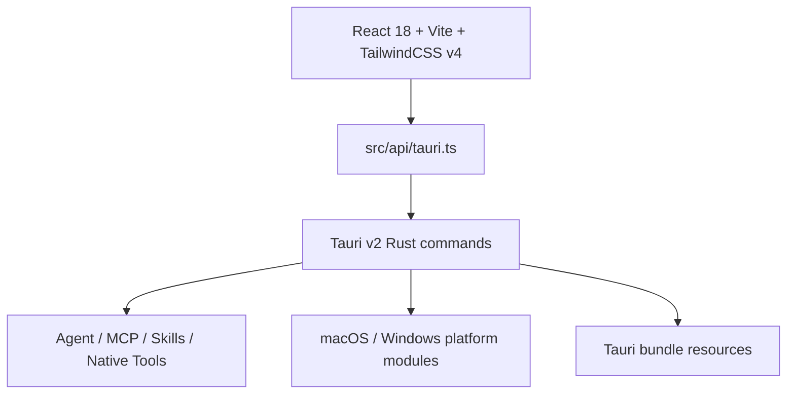

# Project Overview

## Preliminary Direction

Kivio 要从当前 macOS/Windows 优先的轻量桌面 AI 客户端与屏幕级 Agent，按 spec-driven 流程重构适配 Linux 版本，目标环境为 Ubuntu 22.04 / kernel 6.8.0-40-generic，并优先评估 AppImage 交付可行性。

## Evidence Scope

本轮只做前置基线确认，不做业务代码修改，也不做无目标全量通读。已检查的权威入口：

- `package.json`：项目版本、npm 脚本、前端依赖。
- `src-tauri/Cargo.toml`：Rust/Tauri 依赖、平台 cfg 依赖、binary 结构。
- `src-tauri/tauri.conf.json`：Tauri bundle 配置、窗口默认配置、资源配置。
- `.github/workflows/release.yml`：当前 release 自动化目标。
- `docs/RELEASE_PACKAGING.md`：既有发布检查清单。
- `CLAUDE.md`：项目已有架构说明与跨代理约定。
- `AGENTS.md`：Trellis 管理说明，但当前工作树未发现 `.trellis/` 目录。

## Current Architecture



当前架构是 Tauri v2 桌面应用：

- 前端：React 18、TypeScript、Vite、TailwindCSS v4。
- 后端：Rust/Tauri v2，包含窗口管理、截图/OCR、AI Provider、Agent Runtime、MCP、Skills、native tools。
- 当前平台实现重点：macOS 与 Windows。
- Linux 适配重点：把平台能力补成独立端口，而不是把 Linux 分支散落在 UI 和业务流程里。

## Technology Stack

| Layer | Current | Linux Target |
|:--|:--|:--|
| Desktop runtime | Tauri v2 | Tauri v2 |
| Backend | Rust 2021 | Rust 2021 with Linux platform modules |
| Frontend | React 18 + TypeScript | Keep unchanged unless platform UX requires minor adaptation |
| Build tool | Vite 5 + Tauri CLI 2 | Same |
| Styling | TailwindCSS v4 | Same |
| Test | Vitest + cargo test | Same plus Linux-specific smoke/build gates |
| Packaging | DMG / MSI / NSIS configured | AppImage feasibility first, fallback documented |

## Entry Points

- `npm run dev`：完整 Tauri 开发启动。
- `npm run dev:ui`：只启动 Vite UI。
- `npm run build`：运行 Swift sidecar/stub 构建后执行 Tauri build。
- `npm run lint`：ESLint。
- `npm run typecheck`：TypeScript 类型检查。
- `npm test`：Vitest。
- `cargo test --manifest-path src-tauri/Cargo.toml`：Rust 单元测试。

## Build & Run Baseline

`package.json` 当前发布描述仍是 macOS/Windows：

```json
"description": "Kivio - Screen-level AI assistant for macOS and Windows"
```

`tauri.conf.json` 当前 bundle targets：

```json
"targets": [
  "dmg",
  "msi",
  "nsis"
]
```

这说明 Linux 打包尚未作为正式目标进入 Tauri 配置。AppImage 适配必须先验证 Tauri bundle target、系统依赖、资源路径与运行时能力。

## Testing Baseline

已有测试入口：

- 前端：`npm test` / `npm run typecheck` / `npm run lint`。
- Rust：`cargo test --manifest-path src-tauri/Cargo.toml`。

Linux 适配需要新增或明确：

- Linux 平台模块单测。
- AppImage 或替代安装包内容检查。
- X11/Wayland 手工 smoke checklist。
- 屏幕捕获、全局快捷键、托盘、窗口层级、OCR 的桌面行为验证。

## Project Governance Baseline

- `AGENTS.md`：声明项目由 Trellis 管理，并指向 `.trellis/`。
- 当前工作树：未发现 `.trellis/` 目录，Trellis 指向与实际文件存在偏差。
- `CLAUDE.md`：包含较完整的项目架构、命令、发布、代码风格说明。
- `docs/RELEASE_PACKAGING.md`：已有发布检查清单，但当前重点是 macOS/Windows。
- 本次 spec-driven 运行采用 `LOCAL_ONLY` 进度模式，进度入口为 `docs/progress/MASTER.md`。

## External Integrations

- OpenAI-compatible Provider。
- Anthropic Messages Provider。
- MCP servers。
- Skills runtime。
- Pyodide sandbox。
- OS clipboard、hotkey、tray/window APIs。
- macOS ScreenCaptureKit / Apple Vision OCR sidecar。
- Windows `xcap` / Windows OCR APIs。

## Linux Baseline Gap

当前证据显示 Linux 不是一等发布目标：

- Tauri bundle targets 未包含 AppImage/deb。
- Rust 依赖只有 macOS 与 Windows 的 target-specific 平台能力依赖。
- Release workflow matrix 只包含 macOS。
- 现有文档发布主线仍围绕 DMG/MSI/NSIS。
- 屏幕级 Agent 的 Linux 能力边界尚未被建模。
