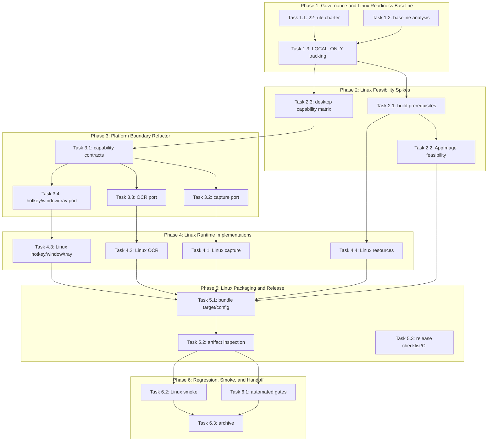

# Task Dependency Graph

```mermaid
graph TD
    subgraph Phase1 [Phase 1: Governance and Linux Readiness Baseline]
        T1_1[Task 1.1: 22-rule charter]
        T1_2[Task 1.2: baseline analysis]
        T1_3[Task 1.3: LOCAL_ONLY tracking]
        T1_1 --> T1_3
        T1_2 --> T1_3
    end

    subgraph Phase2 [Phase 2: Linux Feasibility Spikes]
        T2_1[Task 2.1: build prerequisites]
        T2_2[Task 2.2: AppImage feasibility]
        T2_3[Task 2.3: desktop capability matrix]
        T2_1 --> T2_2
    end

    subgraph Phase3 [Phase 3: Platform Boundary Refactor]
        T3_1[Task 3.1: capability contracts]
        T3_2[Task 3.2: capture port]
        T3_3[Task 3.3: OCR port]
        T3_4[Task 3.4: hotkey/window/tray port]
        T3_1 --> T3_2
        T3_1 --> T3_3
        T3_1 --> T3_4
    end

    subgraph Phase4 [Phase 4: Linux Runtime Implementations]
        T4_1[Task 4.1: Linux capture]
        T4_2[Task 4.2: Linux OCR]
        T4_3[Task 4.3: Linux hotkey/window/tray]
        T4_4[Task 4.4: Linux resources]
    end

    subgraph Phase5 [Phase 5: Linux Packaging and Release]
        T5_1[Task 5.1: bundle target/config]
        T5_2[Task 5.2: artifact inspection]
        T5_3[Task 5.3: release checklist/CI]
        T5_1 --> T5_2
    end

    subgraph Phase6 [Phase 6: Regression, Smoke, and Handoff]
        T6_1[Task 6.1: automated gates]
        T6_2[Task 6.2: Linux smoke]
        T6_3[Task 6.3: archive]
        T6_1 --> T6_3
        T6_2 --> T6_3
    end

    T1_3 --> T2_1
    T1_3 --> T2_3
    T2_2 --> T5_1
    T2_3 --> T3_1
    T3_2 --> T4_1
    T3_3 --> T4_2
    T3_4 --> T4_3
    T2_1 --> T4_4
    T4_1 --> T5_1
    T4_2 --> T5_1
    T4_3 --> T5_1
    T4_4 --> T5_1
    T5_2 --> T6_1
    T5_2 --> T6_2
```
