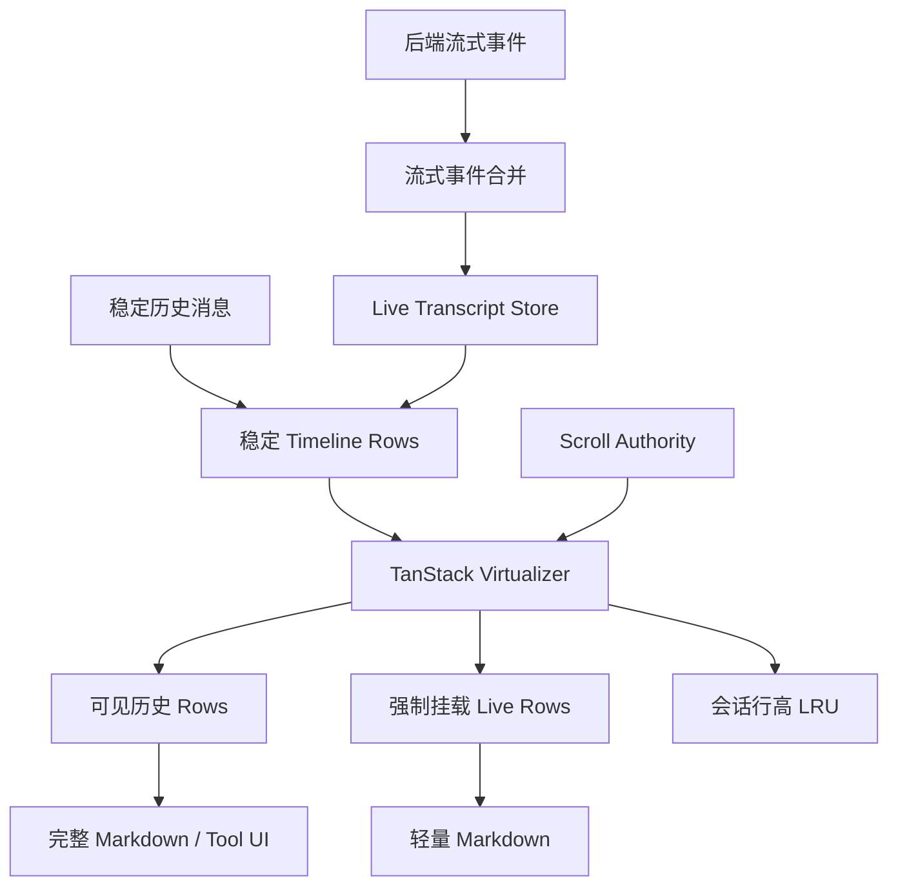

# PRD：Kivio Chat 重型会话渲染性能改造

| 字段 | 内容 |
|---|---|
| 文档版本 | v0.2 |
| 日期 | 2026-08-09 |
| 状态 | 已实现，待实机性能验收 |
| 分支 | `codex/chat-performance-prd` |
| 范围 | Chat 消息列表、会话切换、侧边栏/窗口宽度变化、流式消息渲染 |
| 关联文档 | [Chat 综合优化 PRD](./chat-optimization-prd.md)、[Chat 架构](../CHAT_ARCHITECTURE.md) |
| 参考实现 | `LiveAgent`、`desktop-cc-gui` |

后续源码对照、2026-09-24 滚动修复实测及尚未实施的候选，统一见 [Kivio 对话体验改进：ZCode 对照与实施清单](../research/zcode-chat-comparison-2026-09-24.md)。本 PRD 保留既有需求与验收职责。

---

## 1. 结论摘要

本项目不把“更换虚拟列表库”视为独立目标。性能改造采用四层方案：

1. 使用 `@tanstack/react-virtual` 统一消息列表几何、动态行高和尾部锚定。
2. 历史消息与实时消息分离，流式增量只更新当前 live row。
3. 流式阶段使用轻量 Markdown 和自适应批量刷新，完成后切换完整渲染。
4. 缓存会话行高与稳定消息的派生结果，降低重对话切换和宽度变化成本。

最终性能模型从：

```text
成本 ≈ 最近强制挂载消息的全部 DOM + 每次流式更新的 Markdown 重解析
```

调整为：

```text
成本 ≈ 当前可见 rows + 少量 overscan + 当前 live rows
```

当前实现已完成 Phase 0～4 的代码落地，并将 Phase 5 收敛为单一 Scroll Authority：
TanStack 的 index 导航和测量调整也通过 `useScrollFollow` 的 write adapter，旧的
token、布局 ticket 和双帧 pin 仅作为 authority 内部的浏览器时序保护。M1/M2 等
浏览器实测指标仍需在同一台机器、同一窗口尺寸下采集后确认，不能仅凭单元测试
宣称达标。

本 PRD 第一优先级是性能，不以一次性完成全部滚动状态重构为前置条件。

---

## 2. 背景与当前问题

### 2.1 用户可感知问题

| 编号 | 问题 | 用户表现 |
|---|---|---|
| P1 | 重型会话切换慢 | 点击侧栏对话后窗口停顿，消息延迟出现或先跳动再定位底部 |
| P2 | 折叠/展开侧边栏慢 | 主区宽度改变时 UI 卡顿，重对话尤其明显 |
| P3 | 流式输出占用主线程 | 输出期间滚动、输入、侧栏操作响应变差 |
| P4 | 重型消息成本与条数不匹配 | 少量消息包含大量代码块、表格或工具卡片时仍然很慢 |
| P5 | 切回已打开会话重复付费 | 行高、Markdown 派生结果和重型组件再次初始化 |

### 2.2 当前实现特征

- `@tanstack/react-virtual` 负责聊天主列表的虚拟化和动态高度；`virtua` 仍被
  文件树/文件查看器等 Dock 组件使用，因此本阶段没有从整个仓库删除该依赖。
- `useScrollFollow` 同时监听 `scroll`、`wheel`、`pointer`、`ResizeObserver`，并主动写入 `scrollTop`。
- `MessageList` 使用历史虚拟化、最近消息保留和流式尾部 slot 的混合结构。
- 聊天主列表已删除“最近 24 条历史消息强制实挂载”策略，只保留 TanStack 可见区、
  overscan 和单一尾部 live row。
- 消息成本模型已证明，渲染成本主要受代码块和结构化内容驱动，而非消息条数。
- 会话切换仍通过会话边界重建列表，但会恢复 conversation/layout 维度的测量快照，
  并延迟 Mermaid 等 heavy island 的 hydration。
- 侧边栏折叠已避免逐帧宽度动画，但主区宽度仍会发生一次布局变化，所有已挂载重型内容随之重新换行和测高。

### 2.3 参考项目结论

#### LiveAgent

- 使用 `@tanstack/react-virtual`。
- 使用 `anchorTo: "end"` 和稳定 row key。
- 仅对历史行做正常虚拟化；当前 live rows 通过自定义 `rangeExtractor` 强制保持挂载。
- 使用 `useSyncExternalStore` 订阅实时会话状态。
- 流式增量按 animation frame 合并；隐藏页面使用更低频 fallback。
- 按 `conversationId + viewportWidth + contentWidth` 缓存已测量行高。
- 对 detached reader 的 live row 增长设置专用滚动补偿策略。

#### desktop-cc-gui

- 使用 `@tanstack/react-virtual`。
- 使用 row render weight，而非仅消息条数决定重型路径。
- 使用独立的 Scroll Authority 状态机管理 `free`、`stick-bottom`、`forced-bottom` 和 `jump-anchor`。
- 流式 assistant 文本从完整会话对象外置，避免每个 delta 触发整条时间线更新。
- 流式 Markdown 根据长度、行数、标题、列表和代码块复杂度使用不同刷新间隔。
- 流式中使用轻量 Markdown；完成后恢复完整 Markdown、代码高亮和 Mermaid。
- 延迟加载消息图片，并提供掉帧、long task、render hotspot 等诊断。

---

## 3. 产品目标与非目标

### 3.1 目标

| ID | 目标 | 说明 |
|---|---|---|
| G1 | 加快重型会话切换 | 首次可交互时间主要由可见区域决定，不由最近 24 条重消息决定 |
| G2 | 降低侧边栏折叠卡顿 | 宽度变化时仅让可见 rows 和必要 live rows 参与重排 |
| G3 | 隔离流式更新 | 单个 token/delta 不触发历史消息列表和无关 UI 重渲染 |
| G4 | 保持滚动可预期 | 用户看历史时不被流式增长拉回底部，贴底时稳定跟随 |
| G5 | 可测量、可回滚 | 每阶段都有性能基线、功能开关和回归测试 |

### 3.2 非目标

- 本阶段不重写 Chat 数据存储和后端对话协议。
- 不重做 MessageBubble、MessageGroup 的视觉设计。
- 不立即将所有 Markdown 渲染替换为 `streamdown`。
- 不在第一阶段原样搬入 desktop-cc-gui 的完整 Scroll Authority 复杂度。
- 不以“任何会话都必须 60 FPS”作为未经基线验证的绝对承诺。
- 不同时改造侧栏列表本身、右侧 Dock、设置中心等无关虚拟列表。

---

## 4. 性能基线与成功指标

### 4.1 标准测试夹具

建立四类固定会话夹具：

| 夹具 | 内容 |
|---|---|
| F1 普通长会话 | 200 个普通文本 rows |
| F2 代码重会话 | 20 个 assistant rows，累计不少于 200 个代码块 |
| F3 结构化重会话 | 表格、KaTeX、Mermaid、tool calls、图片和折叠块混合 |
| F4 超长流式消息 | 单条 assistant 内容持续增长到 20k+ 字符，包含代码围栏 |

基线必须优先复用或扩展现有 `chatPerformanceProbe`、React Profiler 和 DOM 节点统计，不先引入大型监控依赖。

### 4.2 采集指标

| 指标 | 定义 |
|---|---|
| Conversation switch input latency | 点击另一对话到点击事件返回、主线程重新可响应的时间 |
| First meaningful transcript paint | 点击对话到首批真实消息可见的时间 |
| Sidebar collapse interaction latency | 点击折叠到主线程可处理下一输入的时间 |
| React commit duration | `MessageList`、`MessageRow`、`ChatShell` 的 commit 时长 |
| Layout/style duration | 宽度变化时浏览器布局和样式计算时长 |
| Mounted row count | 当前挂载的历史 rows、live rows 和 overscan rows 数量 |
| DOM node count | 消息视口内 DOM 总量 |
| Live render cadence | 流式期间每秒 React 可见更新次数 |
| Long task count | 切换、折叠和流式测试期间超过 50ms 的主线程任务数量 |

### 4.3 目标值

目标以“相对基线 + 用户体验门槛”双重定义，最终数值在 Phase 0 采样后锁定。

| ID | 初步目标 |
|---|---|
| M1 | F2/F3 会话切换的首个重型 commit 相比基线降低至少 50% |
| M2 | 侧边栏折叠时参与布局的消息 rows 不超过可见 rows + overscan + live rows |
| M3 | 非流式历史 rows 在流式期间不因文本 delta 重渲染 |
| M4 | 流式正文刷新频率有上限，默认不超过约 14 次/秒；重内容进一步降频 |
| M5 | 切回同宽度会话时复用行高缓存，不出现明显估算高度反复修正 |
| M6 | 用户明确上滚后，流式增长不得自动重新贴底 |
| M7 | 新增优化不得造成消息缺失、导航错位或完成态 Markdown 不一致 |

---

## 5. 目标架构



### 5.1 责任边界

| 模块 | 责任 | 禁止事项 |
|---|---|---|
| TanStack Virtualizer | 行高测量、虚拟窗口、end anchor、滚动到 index/end | 不决定产品层的用户跟随意图 |
| Scroll Authority | free/follow/forced/jump 状态和用户意图 | 不自行监听内容 ResizeObserver 猜测滚动来源 |
| Live Store | 当前回复正文、reasoning、tool 状态的高频数据 | 不重建完整 conversation/messages 数组 |
| Row Projection | 将历史消息与 live row 组合为稳定 rows | 流式 token 不得重建全部历史 rows |
| Markdown Renderer | streaming/settled 两阶段渲染 | 流式期间不重复执行所有重型插件 |
| Measurement Cache | 恢复同会话同布局下的已测量行高 | 不跨不同内容宽度复用尺寸 |

---

## 6. 功能需求

### 6.1 虚拟化与动态测量

| ID | 需求 | 验收标准 |
|---|---|---|
| V-01 | 用 `@tanstack/react-virtual` 替换聊天主列表中的 `virtua` | `MessageList` 不再导入 `virtua` |
| V-02 | 所有消息按正常时间顺序进入一个 virtualizer | 不存在顶部虚拟区 + 底部真实区两套列表 |
| V-03 | row key 必须来自稳定 message/group/boundary id | prepend、stream settle 后 key 不变化 |
| V-04 | 使用 `anchorTo: "end"` | 贴底时动态高度增长不产生可见漂移 |
| V-05 | 仅 live rows 强制挂载 | 不再固定实挂载最近 24 条历史消息 |
| V-06 | 估高按 row 类型和内容复杂度生成 | 首次布局不统一使用单一魔法高度 |
| V-07 | 会话行高按布局宽度缓存 | 同会话同宽度重新打开可恢复 measurements |

### 6.2 会话切换

| ID | 需求 | 验收标准 |
|---|---|---|
| S-01 | 切换时优先挂载底部可见窗口 | 不先挂载整段最近历史再定位底部 |
| S-02 | 首次布局允许短暂 settling 屏障 | 用户不看到估高到实高的连续跳动 |
| S-03 | 已缓存行高的会话直接恢复位置 | 相同布局下切回时总高度和滚动位置快速稳定 |
| S-04 | 首屏重型 islands 支持延迟 hydration | Mermaid、图片和大型工具结果不阻塞首批文本显示 |
| S-05 | 切换时取消前一会话的导航 settle/测量任务 | 不在新会话继续执行旧会话 rAF |

### 6.3 侧边栏和宽度变化

| ID | 需求 | 验收标准 |
|---|---|---|
| W-01 | 侧边栏折叠不触发历史消息 React 重渲染 | Profiler 中 settled rows 不因 `sidebarCollapsed` 更新 |
| W-02 | 宽度变化只重排当前挂载 rows | 屏外历史 rows 不存在 DOM，无法参与 reflow |
| W-03 | 不对主区宽度执行逐帧动画 | 保持当前“布局瞬切 + 侧栏透明度动画”原则 |
| W-04 | ResizeObserver 更新由 virtualizer 统一接管 | 业务层不因宽度变化执行全量 `measure()` 清缓存 |
| W-05 | 宽度变化后的底部保持不依赖双帧 `scrollTop` 写入 | end anchor 或 authority convergence 完成定位 |

### 6.4 流式数据隔离

| ID | 需求 | 验收标准 |
|---|---|---|
| L-01 | 保留并强化现有 streaming/group store | 当前 live row 独立订阅，历史列表引用稳定 |
| L-02 | 文本 delta 按帧或时间窗合并 | 单 token 不直接触发 React state 更新 |
| L-03 | 正文与 tool argument/status 使用不同批量策略 | tool 参数大 burst 不拖慢正文显示 |
| L-04 | 后台页面降低 flush 频率 | 隐藏窗口不维持前台刷新频率 |
| L-05 | settle/abort/save 前强制 flush | 最终持久化内容不得丢失尚未显示的 delta |

建议初始策略：

```text
正文：每 animation frame 最多一次；32ms fallback；累计 640 字符立即 flush
reasoning：80～180ms
tool delta：150～250ms
后台窗口：160～750ms，按数据类型区分
```

### 6.5 Streaming Markdown

| ID | 需求 | 验收标准 |
|---|---|---|
| MD-01 | streaming assistant 使用轻量渲染路径 | 流式时不执行完整 Mermaid/高亮/重型 HTML preview |
| MD-02 | settled assistant 使用现有完整 `ChatMarkdown` | 输出完成后的视觉和功能保持一致 |
| MD-03 | 复杂度分析使用 delta 增量更新 | 长消息不得每次 flush 从头扫描全文形成 O(n²) |
| MD-04 | 根据复杂度调整刷新间隔 | 长代码和结构化文本刷新频率低于普通短文本 |
| MD-05 | 超长流式正文允许头尾折叠 | 20k+ 字符时不持续渲染整个增长中的正文 |

建议初始档位：

```text
短文本：72ms
中等文本：80～100ms
长文本：120～140ms
结构化/代码内容：160～180ms
超长内容：220ms
```

### 6.6 Settled 内容缓存与重型 islands

| ID | 需求 | 验收标准 |
|---|---|---|
| C-01 | 缓存稳定消息的 Markdown block 分析结果 | 同 message id + content hash 重挂载不重复执行可缓存派生计算 |
| C-02 | 缓存代码块元数据、outline 和结构化检测 | 切换回来不重复扫描整段正文 |
| C-03 | Mermaid、图片、HTML preview、大型工具结果作为 heavy islands | 首屏可交互后再 hydrate，保持占位高度 |
| C-04 | 缓存有容量上限和 LRU 淘汰 | 不因打开大量会话无限增长内存 |

---

## 7. Scroll Authority 最小方案

性能改造只需要最小状态机，避免第一阶段扩大为完整滚动重构：

```ts
type ScrollMode =
  | 'free'
  | 'stick-bottom'
  | 'forced-bottom'
  | 'jump-anchor'
```

| 事件 | 当前状态 | 下一状态/行为 |
|---|---|---|
| 用户明确向上滚 | 任意 follow 状态 | `free`，取消程序化 convergence |
| 用户回到近底区域 | `free` | `stick-bottom` |
| 打开会话 | 任意 | `forced-bottom`，布局稳定后转 `stick-bottom` |
| 发送新消息 | 原本贴底 | `forced-bottom` 或 `stick-bottom` |
| 点击回到底部 | `free` | `forced-bottom`，允许平滑动画 |
| 跳转历史消息 | 任意 | `jump-anchor`，结束后转 `free` |
| live row 高度增长 | `stick-bottom` | 由 end anchor 保持底部 |
| live row 高度增长 | `free` | 不改变当前阅读位置 |

本次实现保留这些机制，但它们已经被收敛在 authority 内部：`useScrollFollow` 提供
唯一的 `scrollToOffset` adapter，TanStack 的 `scrollToFn`、消息导航、底部 pin 和
jump 动画都从这里写入；一次性 `ignoreScrollTopRef` token、布局补偿 ticket 和双帧
pin 只负责区分浏览器/测量产生的程序化 scroll 事件，不再由 MessageList 分散处理。

---

## 8. 分阶段实施计划

### Phase 0：性能基线与夹具（代码已完成）

**目标：** 在改代码前确认慢在哪里，并建立可重复比较条件。

- 建立 F1～F4 会话 fixture。
- 扩展 `chatPerformanceProbe`：记录切换、折叠、MessageList commit、mounted rows 和 DOM nodes。
- 增加浏览器性能采集说明、DevTools report API 和 probe 测试。
- 记录迁移前主列表方案基线；Dock 中的 `virtua` 依赖不属于本次聊天主列表迁移范围。

**出口：** F1～F4 fixture、probe、Profiler/DOM/mounted-row/long-task 采集能力和可执行
浏览器报告出口已完成；M1～M7 的最终数值仍待在目标设备上采集。

### Phase 1：虚拟化核心与行高缓存（代码已完成）

**目标：** 优先解决重会话切换和侧边栏宽度变化。

- 引入 `@tanstack/react-virtual`。
- 将 `MessageList` 收敛为单 virtualizer。
- 删除最近 24 条历史强制挂载策略，只强制挂载 live rows。
- 建立稳定 row projection、类型化 estimate 和 live range extractor。
- 建立 conversation/layout measurements LRU。
- 初次打开增加 layout settle 屏障。
- 保持现有视觉和消息功能不变。

**出口：** 单 TanStack virtualizer、动态估高、LRU 快照、heavy island、宽度缓存和
 无 blanket `measure()` 已完成；M1/M2/M5 需要浏览器基线确认。

### Phase 2：流式隔离与批量更新（代码已完成）

**目标：** 流式输出不再拖累历史消息、侧边栏和输入框。

- 将当前 assistant/live group 的高频文本完全外置到 store。
- 文本、reasoning、tool delta 分别 batch。
- 历史 row projection 不依赖高频 snapshot。
- 使用 `useSyncExternalStore` 或等价 selector 让 live row 单独订阅。
- settle/abort/切会话前完成强制 flush。

**出口：** streaming/group store 已按会话订阅、rAF 合帧并在 settle/abort 时 flush；
 测试已覆盖 settled row 隔离，M3/M4 的真实刷新频率仍需浏览器采样。

### Phase 3：轻量 Streaming Markdown（代码已完成）

**目标：** 降低长回答、代码回答和工具回答的主线程成本。

- 增加 `ChatMarkdown` 的 `live` 渲染模式或独立 `LiveMarkdown`。
- 增量计算 streaming complexity。
- 实现自适应 throttle。
- 流式阶段禁用 Mermaid、完整高亮和重型 preview。
- settle 后切换完整 Markdown，并确保最终内容一致。

**出口：** LiveMarkdown 增量解析、长代码头尾预览、复杂语法轻量 fallback 和完成态
 回归已完成；F4 的输入/滚动响应仍需实机采样。

### Phase 4：Settled 缓存与 Heavy Islands（基础能力已完成）

**目标：** 进一步缩短重复打开重对话的首屏时间。

- 增加 Markdown block/outline/code metadata LRU。
- Mermaid、图片、HTML preview 和大型工具结果延迟 hydrate。
- 快速滚动时允许轻量 placeholder。
- 建立缓存容量、淘汰和失效规则。

**出口：** settled Markdown cache、conversation/layout measurement LRU、图片稳定占位、
 Mermaid/HTML/文件卡片边界和容量上限已完成；第二次打开的收益需实机确认。

### Phase 5：Scroll Authority 收敛与清理（代码已完成）

**目标：** 删除兼容期滚动补丁，形成单一所有权。

- 将现有 `useScrollFollow` 收敛为最小 Scroll Authority。
- 程序化滚动只通过一个 convergence/write 入口，TanStack `scrollToFn` 也接入该入口。
- 完成用户上滚、回底、导航跳转、prepend、窗口 resize 回归。
- 删除聊天主列表遗留的 `virtua` 语义和旧辅助代码；Dock 文件树/文件查看器仍保留其独立依赖。

**出口：** 用户上滚、回底、jump 取消、布局补偿、height shrink、same-height offset
 compensation、连续 ResizeObserver delivery、导航跳转和 TanStack adjustment adapter
 回归已覆盖；M6/M7 仍需在目标设备实机验收。

---

## 9. 预计影响文件

### 9.1 Kivio 现有文件

| 文件 | 预计改动 |
|---|---|
| `package.json` | `virtua` 迁移为 `@tanstack/react-virtual` |
| `src/chat/MessageList.tsx` | 单 virtualizer、stable rows、live range、measure cache 接入 |
| `src/chat/messageListVirtualization.ts` | 替换为 row estimates、render weight、range extractor 等纯函数 |
| `src/chat/scroll/useScrollFollow.ts` | 分阶段收敛为 Scroll Authority adapter |
| `src/chat/scroll/scrollFollowCore.ts` | 状态转移简化，删除 scroll 来源时间窗机制 |
| `src/chat/groupStreamingStore.ts` | selector/订阅粒度和 batch 行为调整 |
| `src/chat/hooks/useStreamRenderFrame.ts` | 合并策略、后台策略、强制 flush |
| `src/chat/ChatMarkdown.tsx` | settled/live 双路径入口 |
| `src/chat/markdownStreaming.ts` | 轻量解析和增量复杂度分析 |
| `src/chat/MessageBubble.tsx` | heavy islands、memo 边界、稳定 props |
| `src/chat/ChatConversationPane.tsx` | 首次布局 settling/性能采样边界 |
| `src/chat/chatPerformanceProbe.ts` | 新增指标和 fixture 报告 |
| `src/index.css` | 消息 row margin 约束、contain/placeholder 样式评估 |

### 9.2 新文件候选

```text
src/chat/virtualization/chatVirtualizer.ts
src/chat/virtualization/chatRowEstimates.ts
src/chat/virtualization/chatLiveRange.ts
src/chat/virtualization/chatMeasurementsLru.ts
src/chat/scroll/chatScrollAuthority.ts
src/chat/markdown/LiveMarkdown.tsx
src/chat/markdown/streamingComplexity.ts
src/chat/markdown/settledMarkdownCache.ts
```

实际实现时优先避免过度拆文件；只有具备独立单测价值的纯函数和状态机单独抽出。

---

## 10. 测试与验收矩阵

### 10.1 功能回归

- 普通文本、GFM、数学公式、代码块、Mermaid、引用、图片显示一致。
- 单模型和多模型消息组正常。
- reasoning、tool calls、segments、compaction divider/summary 正常。
- 编辑、删除、重试、重新生成、分叉、回退正常。
- 消息导航和楼层跳转正常。
- 流式完成、取消、错误、恢复和 frozen 状态正常。

### 10.2 滚动回归

- 初次打开会话定位底部。
- 用户上滚后流式输出不拉回底部。
- 用户回到底部后恢复跟随。
- 点击回到底部平滑到达，并在内容继续增长时最终收敛。
- 侧边栏折叠、窗口 resize、图片加载、reasoning 折叠不产生底部漂移。
- prepend 历史或插入 compaction items 时阅读位置稳定。
- 跳转上方消息后不会立即被 follow 拉回。

### 10.3 性能回归

- F1～F4 自动或半自动基线测试。
- 侧边栏折叠前后 mounted rows 记录。
- 重会话切换 Profiler commit 对比。
- 流式期间 settled rows render count 断言。
- 20k+ 字符 streaming complexity 增量路径不得全文重扫。
- measurement LRU 容量和 width invalidation 单测。
- heavy islands 不阻塞首批文本显示。

---

## 11. 发布、开关与回滚

### 11.1 功能开关

建议兼容期保留本地开关：

```text
chat.performance.tanstackVirtualizer
chat.performance.liveRowExternalization
chat.performance.lightweightStreamingMarkdown
chat.performance.settledMarkdownCache
```

默认策略：

- 当前四个开关默认开启，均可通过 localStorage 或全局 flag 单独关闭/刷新，便于同机 A/B。
- 基线采集时应固定窗口尺寸，分别关闭一个开关进行对照，不要把“默认开启”当成已完成的
  性能验收。
- 稳定后删除旧路径和临时开关。

### 11.2 回滚策略

- 每个 Phase 单独提交，不把虚拟化、流式 store 和 Markdown 改造混成一个不可回退提交。
- 新 virtualizer 在旧代码删除前完成 A/B fixture 验证。
- 完成态 Markdown 始终保留现有渲染路径作为一致性基准。
- 缓存全部是内存优化；关闭缓存不影响消息数据正确性。

---

## 12. 风险与应对

| 风险 | 影响 | 应对 |
|---|---|---|
| TanStack 新旧版本 API 差异 | `anchorTo`/snapshot 行为不同 | 锁定并验证具体版本，不用宽泛 semver 后直接发布 |
| live row 强制挂载过多 | 长 agent run 内存上涨 | 只保留真正活跃 rows；settle 后立即退出 live range |
| 轻量 Markdown 与最终视觉不一致 | 流式中短暂差异 | 明确只保证结构可读；完成态必须回到现有完整渲染 |
| 缓存失效错误 | 宽度变化后高度错误 | cache key 包含 viewport/content width 和 row 内容版本 |
| heavy islands 延迟导致高度变化 | 底部或阅读位置漂移 | 使用已知/缓存占位高度并交给 virtualizer 统一补偿 |
| 双实现兼容期复杂 | 临时维护成本提高 | 设置明确删除日期和阶段出口，不长期保留双轨 |
| 过度复制参考项目 | 架构膨胀 | 只复制已验证的设计原则，不原样搬完整诊断与状态机 |

---

## 13. 评审决策点（已执行决策）

本次实现按以下决策执行：

1. 是否同意最终虚拟化库定为 `@tanstack/react-virtual`？
2. 是否同意 Phase 1 优先解决会话切换和侧边栏折叠，而不是先重写全部跟随逻辑？
3. 是否接受 streaming 与 settled Markdown 短暂使用不同渲染路径？
4. 是否接受首屏先显示文本、Mermaid/图片/大型工具卡片稍后 hydrate？
5. 是否同意使用本地性能开关完成分阶段 A/B 后再删除旧路径？
6. M1 的 50% commit 降幅仍作为初始目标，待 Phase 0 实机数据后调整，不作为代码合并前置条件。

---

## 14. 实际交付范围与后续验收

本分支已交付：

```text
Phase 0 fixture / probe / 基线说明
Phase 1 TanStack Virtual + live row + measurements LRU
Phase 2 流式 store 隔离、会话级订阅和批量更新
Phase 3 轻量 Streaming Markdown 与长内容有界预览
Phase 4 settled cache、图片占位和 heavy island 基础能力
Phase 5 滚动跟随兼容性加固（非完整清理）
```

合并前最后一步是使用 `docs/perf/chat-rendering-baseline.md` 的 F1～F4，在目标机器上
记录切换、侧栏折叠、首屏、mounted rows、DOM、commit 和 long task 数据；若 M1～M7
未达标，再依据数据决定是继续调估高/overscan、刷新 cadence，还是收敛剩余 Scroll
Authority 兼容层。
