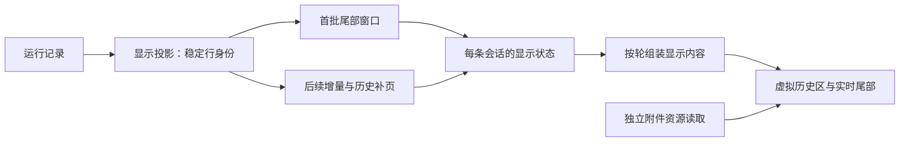

# Kivio 对话体验改进：ZCode 对照与实施清单

更新：2026-09-24。本文统一收录 ZCode 加载、滚动、渲染与附件调查，以及 Kivio 同日滚动修复记录；后续研究和进展在这里更新。

参考：ZCode 3.14.0，提交 `328c1a0c0ffaa5a4f65e8fa199af5e4c20706e5f`；本地源码位于 `E:\ZM database\ZCode-reference`。Kivio 对照基于本次工作区源码。工程规则仍以[统一工程规范](../engineering-standards.md)为准，既有需求与验收见[渲染性能 PRD](../prd/chat-rendering-performance-prd.md)。

**证据口径：第 2 节是此前的 Kivio 合成场景修复与测量；第 3～8 节保留实施前的源码对照和建议。当前交付见第 9 节，针对 `3e102b3e` 的复核见第 10 节，其阅读位置缺陷的后续修复见第 11 节。没有两款应用的同场景性能比较，也没有读取用户对话。**

## 1. 结论与状态

| 事项 | 结论 | 当前状态 |
| --- | --- | --- |
| 快速滚动错位、空白与重代码块负载 | 同步提交、像素预算 overscan、真实代码占位已落地 | 合成场景已验证，见第 2 节 |
| 回切对话重复读取 | 已有 30 秒、4 项、24 MiB 快照保温与 revision 校验 | 已实现，真实回切收益待测 |
| 返回原阅读位置 | 已修正卸载采样时机，并等待真实宽度后恢复 | 浏览器回切通过，误差 0～2px，见第 11 节 |
| 选择/粘贴附件期间切会话 | 异步结果绑定发起草稿，显式迁移新会话 | 已实现，延迟回归通过 |
| 图片重复读取与解码 | 已有在途复用、有界缓存、artifact 列表缩略图与按需原图 | 已实现，真实附件成本待测 |
| 原生滚动条被重新钉底 | 无明确手势时，跟随纠正规则可能与用户定位冲突 | 待 Tauri 实机验证 |
| 整套 UI 替换 | 协议、宿主和产品语义耦合大，按能力适配更合适 | 不建议整包替换 |

阅读入口：[本次复核](#10-实施后复核3e102b3e) · [已完成修复与实测](#2-已完成的滚动修复与实测) · [会话加载](#3-会话加载切换与恢复) · [滚动与渲染](#4-滚动与渲染几何) · [附件](#5-附件与图片生命周期) · [实施清单](#6-移植清单与实施顺序) · [许可](#7-依赖与许可) · [源码范围](#8-源码覆盖与验证边界)。

## 2. 已完成的滚动修复与实测

本节迁入原滚动专项笔记。使用 Edge、真实 MessageList/Markdown/应用样式和合成数据，不调用模型；没有进行 Tauri 原生窗口验收。以下测试成绩为当时记录，本次文档整理没有重跑。

### 2.1 修复内容

1. **同步提交位置和测量结果。** 滚动事件同步挂载新可见范围；ResizeObserver 测高同步更新兄弟行位置。React ref 挂载阶段单独降为普通通知，避免在 commit 内递归 flushSync。保留已有导航、跟随和宽度锚点的职责。
2. **按像素限制屏外渲染。** 每侧以两屏高度为预算，最多六条；长回复通常仅需一条相邻回复，短消息仍保留原有缓冲。导航和宽度恢复的强制挂载邻域继续保留。
3. **保持代码占位的真实布局。** 延迟高亮时继续显示完整纯文本；移除渲染岛的浏览器 intrinsic-size 替代布局，代码块不再受 112px 最小高度约束。Mermaid、HTML 等未知高度内容仍可保留各自的最小占位高度。

### 2.2 测量结果

普通负载为 F2：20 轮问答、200 个代码块。压力负载在同一数据中将每个代码块扩为约 52 行。每 40ms 向上滚动一次，共 30 次，步长分别为 750px 和 9000px。逐 rAF 记录视口内锚点、反向移动、空白帧、挂载节点数量及帧间隔。

原始普通负载可见约 470px 的反向跳动，缩到 8 轮也能复现。单独减少预渲染虽然减少节点，但极快滚动仍暴露出占位高度失真和空白帧，因此最终同时修复布局与提交时序。

| 测试 | 修改前/隔离对照 | 最终复测 |
| --- | --- | --- |
| 普通负载反向跳帧 | 可重复复现，原始一次扫描 19 帧 | 0 |
| 普通负载空白帧 | 未记录完整原始基线 | 0 |
| 普通负载挂载节点峰值 | 2043 | 1023 |
| 压力负载挂载节点峰值 | 21897（仅修同步、固定六条缓冲） | 11088 |
| 压力负载 P95 帧间隔 | 20.8ms（同上） | 8.4ms |
| 压力负载最大帧间隔 | 37.5ms（同上） | 33.3ms |
| 压力负载反向跳帧 / 空白帧 | 中间版本仍会出现空白 | 0 / 0 |

以上是本机开发模式、带测量探针的合成数据结果，受调度、缓存和硬件影响；P95 改善不代表完全消除冷挂载的长帧。连续向下滚动普通负载也通过，未见反向跳帧或空白。6 个消息导航落点误差 0px；另加标题的临时负载中，5 次标题跳转距预期 16px 顶部留白的误差均为 0.5px。未复现独立的导航目标选错问题。

### 2.3 回归入口

单元/组件回归 `src/chat/MessageList.scrolling.test.tsx` 使用真实虚拟列表：验证同一 observer delivery 中滚动补偿与 transform 一致、快速滚动同一 delivery 挂载目标范围，以及长短消息不同的缓冲预算。同步位置和缓冲预算用例均验证过修改前失败。

浏览器回归保留为 `scripts/fixtures/chat-scroll.html` 和 `scripts/probe-chat-scroll.playwright.js`。真实布局不能由 jsdom 的虚拟尺寸可靠覆盖，浏览器探针直接断言反向跳帧和空白帧为零；耗时仅记录，不设置依赖机器性能的硬阈值。

先启动 `npm run dev:ui`（已有桌面开发服务时无需再启动），再运行：

```powershell
playwright-cli -s=chat-scroll open http://localhost:5713/scripts/fixtures/chat-scroll.html --browser=msedge
playwright-cli -s=chat-scroll run-code --filename=scripts/probe-chat-scroll.playwright.js
playwright-cli -s=chat-scroll eval "window.chatScrollReport"
playwright-cli -s=chat-scroll close
```

此探针依赖独立安装的 playwright-cli，不是 npm test 的隐式依赖。

最终检查：16 个相关测试文件、206 项测试通过；typecheck（含协议检查）、lint、architecture:check 和 git diff --check 通过。首次高并发运行中 F3 渲染测试超过 5 秒，单独重跑通过；随后限制为两个 worker 重跑全部 16 个文件，206 项全部通过，未放宽测试超时阈值。

## 3. 会话加载、切换与恢复

### 3.1 两边的现状

| 观察到的实现 | ZCode | Kivio |
| --- | --- | --- |
| 初始读取范围 | 协议常量 `snapshotTailWindowRows: 60`，历史通过 `loadOlder` 按游标补拉；首个窗口若截断了一个 turn，会自动补齐其开头。已加载的旧行合并进投影，故内存并非始终只有 60 行。[协议限制](https://github.com/zai-org/ZCode/blob/328c1a0c0ffaa5a4f65e8fa199af5e4c20706e5f/packages/shared/src/zcode-protocol-v4/core.ts#L75-L76)、[补拉](https://github.com/zai-org/ZCode/blob/328c1a0c0ffaa5a4f65e8fa199af5e4c20706e5f/packages/ui/src/v4/conversationProjectionStore.ts#L981-L1014)、[SessionPane](https://github.com/zai-org/ZCode/blob/328c1a0c0ffaa5a4f65e8fa199af5e4c20706e5f/packages/ui/src/v4/SessionPane.tsx#L3653-L3673) | 每次选择经 `chat_get_conversation` 取完整 `Conversation`，然后交给当前视图；前端消息虚拟化不会减少这次后端读取和跨 IPC 传输。[导航](../../src/chat/chatNavigationController.ts#L213-L253)、[API](../../src/chat/api.ts#L1139-L1150) |
| 短时间回切 | `SessionDataLayer` 以 session 为键共享投影 store，引用归零后默认 30 秒再关闭订阅；回切可能复用暖态。[数据层](https://github.com/zai-org/ZCode/blob/328c1a0c0ffaa5a4f65e8fa199af5e4c20706e5f/packages/ui/src/v4/sessionDataLayer.ts#L24-L39)、[acquire/release](https://github.com/zai-org/ZCode/blob/328c1a0c0ffaa5a4f65e8fa199af5e4c20706e5f/packages/ui/src/v4/sessionDataLayer.ts#L67-L95) | 当前 `selectConversation` 每次仍调用 `readConversation`；`ChatRouteKeepAlive` 保的是聊天/设置页面实例，不是每条会话的数据缓存。[导航](../../src/chat/chatNavigationController.ts#L213-L253)、[KeepAlive](../../src/chat/ChatRouteKeepAlive.tsx#L7-L39) |
| 展示时机 | 订阅 ACK 后仍须等目标 session 的 snapshot；`timelineSnapshot` 校验 lease/session 身份，防止旧会话内容污染新会话滚动恢复。错误态有重连面板。[SessionPane](https://github.com/zai-org/ZCode/blob/328c1a0c0ffaa5a4f65e8fa199af5e4c20706e5f/packages/ui/src/v4/SessionPane.tsx#L3675-L3702)、[展示](https://github.com/zai-org/ZCode/blob/328c1a0c0ffaa5a4f65e8fa199af5e4c20706e5f/packages/ui/src/v4/SessionPane.tsx#L4720-L4753) | 请求代号隔离迟到结果；读完后 `startTransition` 提交，遮罩直到 `MessageList` 的媒体、字体、异步块和布局连续稳定，或到达截止时间才移除。大于 12 条消息的侧栏提示会立即显示 Logo，其余 150ms 后才显示。[导航](../../src/chat/chatNavigationController.ts#L234-L259)、[过渡状态](../../src/chat/conversationTransitionStore.ts#L41-L60)、[布局完成判定](../../src/chat/MessageList.tsx#L357-L460) |

**推断，待测：** 对长历史，Kivio 的整条 JSON 读取、IPC 传输与前端对象构建可能是切换延迟的一部分；`listPopouts` 已缓存结果并合并在途请求，缓存有效时不产生额外 IPC；遮罩等待图片/字体/布局稳定可能增加可见等待。[导航顺序](../../src/chat/chatNavigationController.ts#L234-L253)、[弹窗归属缓存](../../src/chat/chatPopoutOwnershipOwner.ts#L39-L95)。不能从代码推断各环节占比，也不能断言 ZCode 一定更快。建议先分别计时 `listPopouts`、`chat_get_conversation`、`applyConversation` 到首屏 commit、遮罩结束，并按消息数、工具卡数量、附件数分组。若读取/传输占主因，可在现有对话存储负责人中设计尾页读取与更早历史分页；若回切占主因，再评估有容量和失效规则的短期快照缓存。不得绕过 Kivio 对原生会话导入快照的 [ADR-0002](../adr/0002-imported-history-is-a-snapshot.md) 语义。

### 3.2 显示状态与读取成本

ZCode 把运行记录转换成面向产品的时间线行，界面消费快照和增量。文本、推理、工具调用、用户输入和边界有自己的身份，再按 turn 组装成一轮可见内容。滚动负责几何，投影负责内容事实，命令展示作为临时 overlay。这使“打开历史”和“继续流式输出”能够落在同一份显示状态上。[投影策略](https://github.com/zai-org/ZCode/blob/328c1a0c0ffaa5a4f65e8fa199af5e4c20706e5f/packages/shared/src/conversation-message-projection-policy.ts)、[轮次结构](https://github.com/zai-org/ZCode/blob/328c1a0c0ffaa5a4f65e8fa199af5e4c20706e5f/packages/ui/src/v4/conversationTurnRenderUnits.ts#L30-L78)、[store 约定](https://github.com/zai-org/ZCode/blob/328c1a0c0ffaa5a4f65e8fa199af5e4c20706e5f/packages/ui/src/v4/conversationProjectionStore.ts#L1-L27)



Kivio 已有会话 revision、run 序号、断档恢复、独立流式 store 和自适应刷新，不缺这些基础能力。[协议恢复](../../src/api/chatProtocol.ts#L454-L514)、[流式展示负责人](../../src/chat/streamPreviewOwner.ts#L43-L147)。主要差距在稳定历史：切换依赖整份 Conversation；模型转录在出口剥离，列表随后派生分组、几何与导航数据。[后端出口](../../src-tauri/src/chat/commands/catalog.rs#L143-L173)、[前端接收](../../src/chat/Chat.tsx#L585-L611)。

适合 Kivio 的方向是逐步给现有读取接口增加“界面首屏需要的数据”，保留后端完整历史和现有运行协议。一次 assistant 消息可能含大量工具卡，仅机械地截取最后 60 条 ChatMessage 并不能限制负载。窗口设计还需处理多答组、压缩边界、搜索落点和超大单轮；问题导航宜单独返回轻量索引，避免为了显示目录重新拉全量正文。

这里存在两种不同收益：后端先完整解析 JSON 再切尾页，能减少 IPC、前端堆和派生计算，却不能省去完整读盘/解析。若测得后者占主因，再考虑由现有 repository 管理显示快照缓存或索引；不能把“前端分页”写成“磁盘已分页”。

### 3.3 冷打开到退出的生命周期

**冷打开并不只读取几条消息。** renderer 先复用/建立 handshake；宿主获取只读 CLI，等待 provider 配置同步、读取必要元数据。gateway 对冷会话恢复运行时并做历史 materialization，历史与同时到达的 live events 按源水位衔接。publisher 先在候选对象中重建，再原子替换旧投影；批量 replay 将昂贵派生集中到末尾。最后才切出 60 行下发。这种“候选构建成功后提交”可用于 Kivio 的大型派生计算，但没有理由为此整体换掉 JSON 存储。[宿主订阅](https://github.com/zai-org/ZCode/blob/328c1a0c0ffaa5a4f65e8fa199af5e4c20706e5f/packages/services/src/zcode-agent/zcodeAgentService.ts#L4939-L5034)、[cold resume](https://github.com/zai-org/ZCode/blob/328c1a0c0ffaa5a4f65e8fa199af5e4c20706e5f/apps/zcode-cli/packages/bootstrap/src/zcode-protocol-v4/cold-session-resume.ts)、[gateway hydration](https://github.com/zai-org/ZCode/blob/328c1a0c0ffaa5a4f65e8fa199af5e4c20706e5f/apps/zcode-cli/packages/bootstrap/src/zcode-protocol-v4/v4-gateway.ts#L2895-L3156)、[候选重建](https://github.com/zai-org/ZCode/blob/328c1a0c0ffaa5a4f65e8fa199af5e4c20706e5f/apps/zcode-cli/packages/bootstrap/src/zcode-protocol-v4/conversation-topic-publisher.ts#L607-L747)。

**ACK 不等于数据到齐，也不等于画面可交互。** 即使服务端先发送 ACK，通知回调仍可能先于 await 的 continuation 执行。ZCode 用 activation barrier 暂存物理帧，等 store 记录 subscriptionId 后才释放；每个 pending subscription 限 1024 帧/32 MiB，溢出整批作废并触发恢复。宿主 outbox、renderer barrier、逻辑帧 decoder 共同保证首帧交接。Kivio 普通 getConversation 是单个 Promise，不需要额外套这整套订阅握手；只有现有事件通道存在同类交接竞态时才值得提取。[barrier](https://github.com/zai-org/ZCode/blob/328c1a0c0ffaa5a4f65e8fa199af5e4c20706e5f/packages/ui/src/v4/ackActivationBarrier.ts)、[connect](https://github.com/zai-org/ZCode/blob/328c1a0c0ffaa5a4f65e8fa199af5e4c20706e5f/packages/ui/src/v4/conversationProjectionStore.ts#L393-L488)、[snapshot gate](https://github.com/zai-org/ZCode/blob/328c1a0c0ffaa5a4f65e8fa199af5e4c20706e5f/packages/ui/src/v4/SessionPane.tsx#L3675-L3702)。

**出错恢复有阶梯，且不重发用户命令。** 旧 subscription/generation 的结果失效；重复 delta 忽略，`fromSeq` 不连续时保留最后合法快照。通常先向同订阅请求 resync，失败升级一次强制 snapshot，再失败暴露错误。恢复 ACK 与有效恢复帧都到达才结束；ACK 后等待帧有 30 秒期限。runtime unavailable 保留画面，换代重连有 250/1000/3000ms 的有限重试。accepted send 后若 2 秒仍没有对应 userInput/queue 投影，再请求状态恢复，不重复发送内容。Kivio 已有序号/断档恢复，应对照补边界，不能另起第二套流式事实来源。[应用边界](https://github.com/zai-org/ZCode/blob/328c1a0c0ffaa5a4f65e8fa199af5e4c20706e5f/packages/ui/src/v4/conversationProjectionStore.ts#L602-L757)、[恢复](https://github.com/zai-org/ZCode/blob/328c1a0c0ffaa5a4f65e8fa199af5e4c20706e5f/packages/ui/src/v4/conversationProjectionStore.ts#L803-L946)、[Kivio 协议](../../src/api/chatProtocol.ts#L454-L514)。

**保温的是实时状态，不是一次读取的结果。** 引用归零后 30 秒仍收帧；回切取消释放定时器，第二 pane 可共享 store。超时关闭投影订阅并不停止 agent 运行。renderer 新建 store 的 cold 与后端 runtime cold 是两个维度。它没有统一 entry/字节上限，而宽屏可能已拉完整历史，因此照搬 30 秒会同时引入潜在内存峰值。Kivio 应在已有导航/会话数据负责人内实现容量、revision 与编辑/删除/后台完成失效规则。[SessionDataLayer](https://github.com/zai-org/ZCode/blob/328c1a0c0ffaa5a4f65e8fa199af5e4c20706e5f/packages/ui/src/v4/sessionDataLayer.ts)、[transport 换代](https://github.com/zai-org/ZCode/blob/328c1a0c0ffaa5a4f65e8fa199af5e4c20706e5f/packages/ui/src/v4/replaceableConversationTransport.ts)。

请求归属与换代还要保留这些约束：

- workspace/connection/topic 管订阅归属，connect generation 隔离旧请求，runtime generation 隔离旧进程 ACK，subscriptionId 拒绝旧订阅帧；epoch/seq 管投影连续性，逻辑帧 ordinal 管迟到分片。这些身份不能压成一个请求序号。
- 冷恢复与 hydration 分别合并在途请求；重建期间暂存 live events，按源水位去重衔接。候选重建失败保留旧投影，避免让半成品进入界面。
- transport 代理替换保留当前 base，由服务端决定 resume/snapshot；真实 runtime 重启则强制 snapshot。旧代理的迟到 ACK 在旧 transport 上清理，避免误取消新进程同名订阅。
- ACK barrier 的 1024 帧/32 MiB 是每个 pending subscription 的限制，并非全局预算；首批溢出重试一次强制快照。目录失败按 250/1000ms 有限重试，终态缓存还依赖 query 目录 revision。

依据：[订阅与恢复状态](https://github.com/zai-org/ZCode/blob/328c1a0c0ffaa5a4f65e8fa199af5e4c20706e5f/packages/ui/src/v4/conversationProjectionStore.ts)、[transport 换代](https://github.com/zai-org/ZCode/blob/328c1a0c0ffaa5a4f65e8fa199af5e4c20706e5f/packages/ui/src/v4/replaceableConversationTransport.ts)、[gateway](https://github.com/zai-org/ZCode/blob/328c1a0c0ffaa5a4f65e8fa199af5e4c20706e5f/apps/zcode-cli/packages/bootstrap/src/zcode-protocol-v4/v4-gateway.ts)。

分页还有几个必须一起知道的限制：

- 普通 `loadOlder` 默认 60 行，共享 `loadingOlder` 在途锁；核对未关闭、epoch 未变、首 cursor 未变后提交。返回的 atSeq/atRevision 没有作为该处版本比较条件，不能声称它实现了完整版本 CAS。
- `loadAllOlder` 每页 200、顺序获取，最后一次提交，减少每页重建轮次；若完整历史不足两个真实 query，通常丢弃补拉页并缓存终态，但补齐截断首轮的必要情况例外。这个分支仍可能先付出全量读取成本。
- 普通补页失败不会把整个会话切到 error，可再次触发；目录失败有限重试。首窗缺 turnHeader 时由 SessionPane 自动补齐，避免“内容不足以滚动，所以永远触发不了 loadOlder”。
- subscribe/resync/rowsRange 的失效主要是撤销结果提交权，不会取消已经开始的历史 I/O。不要把 generation guard 叫作真实取消。

依据：[普通补页与全量目录补齐](https://github.com/zai-org/ZCode/blob/328c1a0c0ffaa5a4f65e8fa199af5e4c20706e5f/packages/ui/src/v4/conversationProjectionStore.ts#L981-L1175)、[首轮补齐](https://github.com/zai-org/ZCode/blob/328c1a0c0ffaa5a4f65e8fa199af5e4c20706e5f/packages/ui/src/v4/SessionPane.tsx#L3649-L3673)。

### 3.4 搜索和目录的后台加载

- 问题导航不等用户点击：容器达到 864px 时可以自动全量补历史，一次提交给视图；目录自身另用小行虚拟列表，避免上千个导航按钮全挂载。**目录 DOM 虚拟化没有消除正文数据补全成本。**
- 会话查找在非 running/prewarming 时自动补页，触发前判断已加载行数小于 1200；这个值是触发阈值，不是精确截断，更不是全局内存上限。另一条宽屏目录补齐路径不受它约束。
- 查找按稳定 turn 缓存结果，运行 turn 重新索引；先挂载目标 turn，再对 DOM Text Range 做 CSS Highlights。不会为了着色改写 Markdown 文本树，但原始文本索引与按单个 Text node 匹配的 DOM 高亮并非天然一一对应，跨格式节点匹配必须另测。
- 导航活动项仍会扫描已挂载 `[data-row-id]` 并调用 `getBoundingClientRect()`；`syncTurnNavigatorViewport` 在 scroll 路径上运行，前面还写 mask。不能把 ZCode 描述为“不读 DOM、无同步布局成本”。Kivio 当前对应扫描有 120ms 节流，是否要改应由 trace 决定。

依据：[目录补齐](https://github.com/zai-org/ZCode/blob/328c1a0c0ffaa5a4f65e8fa199af5e4c20706e5f/packages/ui/src/v4/ConversationTimeline.tsx#L615-L685)、[目录组件](https://github.com/zai-org/ZCode/blob/328c1a0c0ffaa5a4f65e8fa199af5e4c20706e5f/packages/ui/src/v4/ConversationTurnNavigator.tsx)、[查找 hook](https://github.com/zai-org/ZCode/blob/328c1a0c0ffaa5a4f65e8fa199af5e4c20706e5f/packages/ui/src/v4/useConversationTimelineFind.ts)、[DOM 高亮](https://github.com/zai-org/ZCode/blob/328c1a0c0ffaa5a4f65e8fa199af5e4c20706e5f/packages/ui/src/v4/conversationFindHighlightDom.ts)、[导航扫描](https://github.com/zai-org/ZCode/blob/328c1a0c0ffaa5a4f65e8fa199af5e4c20706e5f/packages/ui/src/v4/ConversationTimeline.tsx#L914-L948)、[Kivio 扫描](../../src/chat/MessageList.tsx#L1696-L1768)。

## 4. 滚动与渲染几何

### 4.1 三类成本

1. **数据加载量**：尾窗快照限制首帧传输；补页继续增加 renderer 中的历史。后端已有全量投影，`rowsRange` 在其上选取行，不能把它称为磁盘分页。
2. **DOM 挂载量**：历史按 product turn 虚拟化，overscan 为 8 个 turn；当前运行轮放在虚拟历史后面的正常文档流中。一个 turn 仍可能很大，虚拟化不等于对该 turn 内全部内容分页。
3. **位置稳定**：动态高度只是输入，还要决定用户意图、恢复、前插、导航、宽度变化的优先级，以及何时写入 scrollTop。任何一个分支越权都会产生回弹或跳位。

源码：[尾窗](https://github.com/zai-org/ZCode/blob/328c1a0c0ffaa5a4f65e8fa199af5e4c20706e5f/apps/zcode-cli/packages/bootstrap/src/zcode-protocol-v4/conversation-topic-publisher.ts#L304-L334)、[虚拟器](https://github.com/zai-org/ZCode/blob/328c1a0c0ffaa5a4f65e8fa199af5e4c20706e5f/packages/ui/src/v4/ConversationTimeline.tsx#L695-L769)、[历史与 live DOM](https://github.com/zai-org/ZCode/blob/328c1a0c0ffaa5a4f65e8fa199af5e4c20706e5f/packages/ui/src/v4/ConversationTimeline.tsx#L1812-L1882)。

### 4.2 各类滚动事件

| 场景 | ZCode 实际规则 | 对 Kivio 的判断 |
| --- | --- | --- |
| 首次打开 | 无阅读记忆或原先贴底，则立即到底；有离底记忆则恢复。会话切换清测高缓存和 prepend 基线，防跨会话 rowId 重用 | Kivio 新绑定默认贴底，缺的是跨会话阅读位置恢复，不是基本贴底 |
| A → B → A | scope 变化前用 `getSnapshotBeforeUpdate` 读取旧 DOM；普通 layout cleanup 此时可能已经看到新 DOM。卸载另行保存；最多保留 200 份记忆 | 值得借鉴“保存发生在哪个生命周期”。Kivio MessageList 按 conversationId 重挂，可在旧实例清理时保存，不必为此照搬 class 组件 |
| 数据还没来 | 保留 pending restore，临时 scrollTop 被 clamp 到 0 时不覆盖旧记忆；rows 到达和测高后再校正 | 恢复必须跨过“数据未到”和“高度未就绪”，只存一个数值不足以完成产品行为 |
| 用户开始上滚 | wheel/touch/key 捕获先交出 following，再等 scroll 事件；解决同帧 stream commit 抢先贴底的竞态 | Kivio 已有手势先解除跟随，且处理横向滚动、嵌套代码滚动和拖选；保留这些保护 |
| 内容或图片长高 | layout effect 与 live tail 的 ResizeObserver 都先核对跟随权；只在 following 时贴底。历史尺寸补偿只处理完全位于视口上方的行 | Kivio 已有 RO、单一写入口和用户脱离标记；不能增加第二套跟随 hook |
| 流式结束 | 运行轮移回虚拟历史，同时可能折叠过程区；这些几何回退按 layout 处理，不等同于用户上滚 | 必须测 running → completed/interrupted/tool error 的交接；只测持续输出覆盖不到这里 |
| 改变窗口/侧栏宽度 | 宽度变化期间暂停逐行补偿和贴底，静止 120ms 后仅在仍 following 时最终贴底 | Kivio 已有宽度桶、布局独立缓存和阅读行锚定，更适合保留。ZCode 的暂停策略并未替离底用户完整重建语义阅读锚点 |
| 向上补历史 | 距顶两个视口便预取；先保存稳定 turn key 及相对视口偏移，前插后恢复。找不到 key 才退回总高度差补偿 | 若 Kivio 引入分页，这个算法可适配；纯粹 `scrollTop += 新旧 scrollHeight 差` 对同帧其他测高变化不够可靠 |
| 恢复与前插同时发生 | pending detached restore 拥有锚点时，prepend 不再叠加位移；避免对临时 clamp 坐标补两次 | 这是移植分页时必须一起带入的约束 |
| 程序写入后虚拟窗未更新 | 读回浏览器 clamp 后的 scrollTop；在 commit 后微任务派发 scroll 通知，使虚拟器更新窗口 | 学习“滚动坐标和挂载窗口需一起提交”。不要无条件把合成 scroll 加到 Kivio；已有同步提交的路径应先实测 |
| 问题导航跳转 | 先定位所属虚拟 turn，再按 rowId 找真实 DOM；最多 12 个 rAF 等待锚点挂载 | Kivio 已有 prepare/hold、强制挂载和稳定判定；ZCode 更短的代码不代表处理更全 |
| 清空、切换、卸载 | 清前插基线、测高、导航 rAF、延迟目录重试、width timer 和 observers；旧 action ref 只清自己的登记 | 引入缓存和恢复必须带上这些退出条件 |

依据：[读取旧 DOM](https://github.com/zai-org/ZCode/blob/328c1a0c0ffaa5a4f65e8fa199af5e4c20706e5f/packages/ui/src/v4/ConversationTimeline.tsx#L210-L234)、[输入捕获](https://github.com/zai-org/ZCode/blob/328c1a0c0ffaa5a4f65e8fa199af5e4c20706e5f/packages/ui/src/v4/ConversationTimeline.tsx#L806-L875)、[宽度与 live RO](https://github.com/zai-org/ZCode/blob/328c1a0c0ffaa5a4f65e8fa199af5e4c20706e5f/packages/ui/src/v4/ConversationTimeline.tsx#L1058-L1143)、[预取](https://github.com/zai-org/ZCode/blob/328c1a0c0ffaa5a4f65e8fa199af5e4c20706e5f/packages/ui/src/v4/ConversationTimeline.tsx#L1183-L1253)、[导航](https://github.com/zai-org/ZCode/blob/328c1a0c0ffaa5a4f65e8fa199af5e4c20706e5f/packages/ui/src/v4/ConversationTimeline.tsx#L1283-L1352)、[恢复/前插/跟随](https://github.com/zai-org/ZCode/blob/328c1a0c0ffaa5a4f65e8fa199af5e4c20706e5f/packages/ui/src/v4/ConversationTimeline.tsx#L1435-L1685)。Kivio 对照：[scroll owner](../../src/chat/scroll/useScrollFollow.ts)、[width owner](../../src/chat/hooks/useChatWidthLayout.ts)、[虚拟器同步与补偿](../../src/chat/MessageList.tsx#L872-L995)。

还有两项布局细节：导入的只读 header 高度通过 RO 进入 `scrollMargin`，虚拟行 transform 再减去该高度；正文子树禁用浏览器 `overflow-anchor`，防止原生锚点和应用恢复争夺滚动位置。composer 是同一视口中的 sticky dock，ZCode 为其留白增加了动态消息 mask，带来额外几何同步。Kivio 若保持自己的 composer 布局，就没有必要一起搬入这些定位和 mask 代码。[header 测量](https://github.com/zai-org/ZCode/blob/328c1a0c0ffaa5a4f65e8fa199af5e4c20706e5f/packages/ui/src/v4/ConversationTimeline.tsx#L391-L415)、[mask](https://github.com/zai-org/ZCode/blob/328c1a0c0ffaa5a4f65e8fa199af5e4c20706e5f/packages/ui/src/v4/ConversationTimeline.tsx#L877-L912)、[原生锚点](https://github.com/zai-org/ZCode/blob/328c1a0c0ffaa5a4f65e8fa199af5e4c20706e5f/packages/ui/src/v4/ConversationTimeline.tsx#L1772-L1775)。

### 4.3 Kivio 尚需验证的问题

**Kivio 原生滚动条/外部定位可能被重新钉底。** 当前 `reduceFollowEvent` 在 following=true、pointerHeld=false 时，即使 scroll 的 source 为 user，只要 gap 超过 12px 仍返回 pin=true；现有单测明确要求这个行为。它是避免测高噪声误解除跟随的设计选择，但用户没有 wheel/touch/key、也未触发 pointerHeld 的真实滚动会进入相同分支。ZCode 会区分 programmatic/layout/user，再允许 user 落点解除跟随。应在 Tauri WebView 录制拖原生滚动条、浏览器查找/焦点定位的实际事件序列，再决定如何兼顾；不能直接删除 Kivio 的纠正逻辑，更不能把这个条件路径说成已复现的根因。[当前规则](../../src/chat/scroll/scrollFollowCore.ts#L162-L180)、[现有期望](../../src/chat/scroll/scrollFollowCore.test.ts#L70-L74)、[ZCode 分类](https://github.com/zai-org/ZCode/blob/328c1a0c0ffaa5a4f65e8fa199af5e4c20706e5f/packages/ui/src/v4/ConversationTimeline.tsx#L1183-L1219)。

**首屏已能看见内容与遮罩结束要分开计时。** Kivio 等图片、字体、异步重内容与至少 80ms 的稳定期，最长 2 秒。它保证揭开时的稳定性，也可能掩盖“正文已经可读、某张图还没完成”的时间。要学习 ZCode 的首屏窗口和阶段计时，不能简单删掉等待。后续可以在真实比例占位可靠的前提下，让非关键媒体独立完成。[首屏判定](../../src/chat/MessageList.tsx#L357-L460)。

**ZCode 的记忆算法也不是理想答案。** 它保存像素 scrollTop、总高度和是否贴底，没有保存消息身份与布局版本；不同宽度、不同历史窗口、内容编辑后，同一个像素不一定是同一句话。适合 Kivio 的恢复记录应包含稳定消息/轮次 key 与相对偏移，沿用现有布局和 revision 校验；不存在该目标时明确回退。

### 4.4 统一滚动控制的约束

在 Kivio 现有 scroll owner 内定义优先级即可，不另建平行控制器：

1. 新用户手势取消旧恢复、导航保持和宽度修正。
2. 有效导航请求或会话阅读位置恢复拥有一个明确目标；分页补偿不重复叠加。
3. 离底阅读时，只补偿锚点上方的高度变化；展开当前内容不把点击处推走。
4. 仍处于跟随状态时，内容增长才可以贴底；终态折叠和布局补偿本身不代表用户改变意图。
5. 所有 scrollTop 写入仍通过 `ScrollFollowHandle`，同时让虚拟器在绘制前得到一致的坐标和测量结果。

ZCode 的数值（48px 底部阈值、1200ms 输入意图寿命、250ms layout guard、120ms resize settle、8 turn overscan）是其实现选项，不是应复制的性能标准。Kivio 已有 12px 贴底阈值、显式布局补偿票据及按像素预算的 overscan，移植应围绕行为用例，而不是统一这些常量。

### 4.5 轮次、Markdown 与重内容

渲染层也追到了最终内容：rows 先按稳定 turnId 组装，补齐更早 turnHeader 不改变该轮 key；过滤不展示的 reasoning/tool 状态之后才做连续工具分组，组 key 取第一项稳定身份。空工作组在创建折叠容器前返回 null，折叠间距放在被测量内容内部，防止关动画后再掉一段 padding。最终轮次还包含 workflow/automation、文件总结、截图、操作栏与边界标记，都会影响高度，不能只对 Markdown 正文做测量。[组轮](https://github.com/zai-org/ZCode/blob/328c1a0c0ffaa5a4f65e8fa199af5e4c20706e5f/packages/ui/src/v4/conversationTurnRenderUnits.ts#L360-L480)、[工具分组](https://github.com/zai-org/ZCode/blob/328c1a0c0ffaa5a4f65e8fa199af5e4c20706e5f/packages/ui/src/v4/conversationAssistantWorkItems.ts#L283-L425)、[折叠几何](https://github.com/zai-org/ZCode/blob/328c1a0c0ffaa5a4f65e8fa199af5e4c20706e5f/packages/ui/src/v4/ConversationTurnGroup.tsx#L645-L675)、[轮次尾部](https://github.com/zai-org/ZCode/blob/328c1a0c0ffaa5a4f65e8fa199af5e4c20706e5f/packages/ui/src/v4/ConversationTurnGroup.tsx#L1383-L1445)。

- ZCode 完成态采用 Streamdown static、实时态采用 streaming；Kivio 的 ChatMarkdown 有明确的固定 streaming 模式兼容策略，也已有历史解析缓存、延迟代码高亮和重内容占位。可以做局部试验，但切一个 mode 不是已经证实的性能修复。[ZCode message](https://github.com/zai-org/ZCode/blob/328c1a0c0ffaa5a4f65e8fa199af5e4c20706e5f/packages/ui/src/components/ai-elements/message.tsx#L1561-L1655)、[Kivio](../../src/chat/ChatMarkdown.tsx#L1255-L1281)
- ZCode 代码块的 `content-visibility:auto` / `contain-intrinsic-size:auto 200px` 不宜照抄。第 2 节已记录 Kivio屏外长代码块占位高度污染测量的问题，现有真实文本占位应保留。[ZCode code-block](https://github.com/zai-org/ZCode/blob/328c1a0c0ffaa5a4f65e8fa199af5e4c20706e5f/packages/ui/src/components/ai-elements/code-block.tsx#L147-L165)、[已有复现](#2-已完成的滚动修复与实测)
- ZCode 的 turn/work 分组是合理的产品结构，但依赖它的 row、workflow、hook 与工具 display 协议；Kivio 已有工具过程折叠、memo 和收起内容卸载。照搬 TurnGroup 会连带迁移大量产品语义。适合借鉴“先裁掉不展示的行，再按稳定轮次组装”的规则，接到现有消息展示模型。[ZCode 工作项](https://github.com/zai-org/ZCode/blob/328c1a0c0ffaa5a4f65e8fa199af5e4c20706e5f/packages/ui/src/v4/conversationAssistantWorkItems.ts#L272-L300)、[Kivio 分组](../../src/chat/MessageBubble.tsx#L727-L820)

## 5. 附件与图片生命周期

### 5.1 草稿、发送与预览现状

| 观察到的实现 | ZCode | Kivio |
| --- | --- | --- |
| 草稿归属 | 按 workspace/scope 键保留附件状态；等待会话、排队、上传、提交、就绪、失败有明确状态，切 task/composer 不丢内存 File/object URL。[store](https://github.com/zai-org/ZCode/blob/328c1a0c0ffaa5a4f65e8fa199af5e4c20706e5f/packages/ui/src/store/composerAttachmentUploadStore.ts#L6-L46)、[hook](https://github.com/zai-org/ZCode/blob/328c1a0c0ffaa5a4f65e8fa199af5e4c20706e5f/packages/ui/src/v4/composer/useComposerAttachments.ts#L206-L218) | 按会话键把输入、引用和 `PendingAttachment[]` 存在进程内 Map，切换后恢复；同样不会因普通切换立刻丢草稿。[草稿](../../src/chat/composerDraft.ts#L1-L36)、[InputBar](../../src/chat/InputBar.tsx#L561-L623) |
| 传输与发送 | 本地文件路径可直接作为 ref；内联 File 走 put，远端本地文件先 stage，带进度、取消、重试及发送后 adopt；未就绪时 `prepareForSend` 拒绝提交。[附件派发](https://github.com/zai-org/ZCode/blob/328c1a0c0ffaa5a4f65e8fa199af5e4c20706e5f/packages/ui/src/v4/composer/attachmentUpload.ts#L39-L79)、[远端暂存](https://github.com/zai-org/ZCode/blob/328c1a0c0ffaa5a4f65e8fa199af5e4c20706e5f/packages/ui/src/v4/composer/useComposerAttachments.ts#L315-L393)、[发送边界](https://github.com/zai-org/ZCode/blob/328c1a0c0ffaa5a4f65e8fa199af5e4c20706e5f/packages/ui/src/v4/composer/useComposerAttachments.ts#L1032-L1059) | 选择路径时先分类、按路径去重；发送时后端把文件复制到对话附件目录，目录保留原路径。粘贴的无路径文件在发送前保存为临时文件。[InputBar](../../src/chat/InputBar.tsx#L685-L721)、[去重](../../src/chat/InputBar.tsx#L1035-L1058)、[粘贴](../../src/chat/InputBar.tsx#L1568-L1612)、[后端复制](../../src-tauri/src/chat/attachments.rs#L820-L875) |
| 图片预览 | File 附件建 object URL 并在移除时 revoke；路径附件未必有 object URL，不能概括成所有图片都零拷贝预览。[附件对象](https://github.com/zai-org/ZCode/blob/328c1a0c0ffaa5a4f65e8fa199af5e4c20706e5f/packages/ui/src/lib/chatAttachments.ts#L83-L106)、[释放](https://github.com/zai-org/ZCode/blob/328c1a0c0ffaa5a4f65e8fa199af5e4c20706e5f/packages/ui/src/lib/chatAttachments.ts#L134-L137) | 图片卡片挂载时调用 `chat_read_attachment`，后端读取整文件并编码 data URL，预览上限 12 MiB；组件只用 `cancelled` 抑制迟到 setState，不取消这次读取。已落盘 artifact 有内联缩略图占位，但 `ArtifactImage` 挂载时仍主动读整图。[卡片](../../src/chat/ChatAttachments.tsx#L37-L65)、[读取](../../src/chat/attachmentPreview.ts#L11-L34)、[后端](../../src-tauri/src/chat/commands/attachments.rs#L11-L24)、[上限/编码](../../src-tauri/src/chat/attachments.rs#L238-L250)、[artifact](../../src/chat/MessageBubble.tsx#L159-L170) |

**推断，待测：** 同一会话反复打开或虚拟行反复挂载时，Kivio 已发送图片可能重复发生磁盘读取、Base64 编码、IPC 传输与解码；这是可测的潜在卡顿来源，不代表所有附件都存在问题。先记录一次切换期间 `chat_read_attachment` 次数、字节数、耗时与重挂载次数；若显著，再考虑受限缩略图缓存或统一缩略图路径，保持现有附件目录和路径校验。ZCode 的远端 stage/adopt 解决的是跨主机可读性，Kivio 当前本地路径模型不应直接照搬该状态机。

### 5.2 异步附件归属风险

Kivio 的 InputBar 在已有对话之间可保持挂载，`draftKeyValue` 变化后恢复新草稿。文件选择 `openAttachmentPicker` 在 await 对话框和 `pendingFromPaths` 之后直接 `addAttachments`；普通 Ctrl+V 也在等待临时文件保存后直接添加，只有菜单目标路径检查 `isCurrent()`。[切换草稿](../../src/chat/InputBar.tsx#L587-L623)、[文件选择](../../src/chat/InputBar.tsx#L1142-L1164)、[粘贴](../../src/chat/InputBar.tsx#L1572-L1624)、[挂载位置](../../src/chat/ChatConversationPane.tsx#L274)

由此静态可达的场景是：在 A 粘贴图片 → 临时文件保存尚未完成 → 切到 B → 完成回调把附件加到 B。尚未运行回归用例确认，但比“附件可能慢”更具体。ZCode 的价值是异步入口捕获 scope，完成时对该 scope 提交。落地应先用可控延迟复现，再决定原草稿保留结果及新建占位键迁移规则，同时让错误提示也归属于原操作；只给最后一个 setState 加 isCurrent 会丢失原草稿中的操作结果。

具体借鉴位置是 ZCode 的 `updateScope(targetScopeKey)` 与选择文件闭包，不必导入它整套上传 store。[scope 更新](https://github.com/zai-org/ZCode/blob/328c1a0c0ffaa5a4f65e8fa199af5e4c20706e5f/packages/ui/src/v4/composer/useComposerAttachments.ts#L239-L257)、[选择文件](https://github.com/zai-org/ZCode/blob/328c1a0c0ffaa5a4f65e8fa199af5e4c20706e5f/packages/ui/src/v4/composer/useComposerAttachments.ts#L706-L726)

### 5.3 缓存、缩略图与资源释放

ZCode gateway 的缓存键包含 session、message、attachmentIndex 与 ref；先把 Promise 放入 Map，所以并发分块读取可以共用一次文件读取，失败会删除项。已完成字节按最近访问时间淘汰，常量为 30 秒/30 MiB。这个数值是源码事实，不是建议照抄的 Kivio 预算：pending 请求未计入已完成字节上限，TTL 淘汰不取消底层 I/O，因此还不是严格的峰值内存上限。[缓存实现](https://github.com/zai-org/ZCode/blob/328c1a0c0ffaa5a4f65e8fa199af5e4c20706e5f/apps/zcode-cli/packages/bootstrap/src/zcode-protocol-v4/v4-gateway.ts#L2263-L2333)、[限制](https://github.com/zai-org/ZCode/blob/328c1a0c0ffaa5a4f65e8fa199af5e4c20706e5f/packages/shared/src/zcode-protocol-v4/core.ts#L83-L94)、[媒体上限](https://github.com/zai-org/ZCode/blob/328c1a0c0ffaa5a4f65e8fa199af5e4c20706e5f/packages/shared/src/zcode-media-policy.ts#L2)

Kivio 已发送附件会复制成独立 UUID 文件，已有稳定的持久身份，缓存应复用它。对尚未发送的绝对路径，需要内容版本/文件元数据或短期失效策略，避免文件被覆盖后继续展示旧图。[持久副本](../../src-tauri/src/chat/attachments.rs#L841-L855)

更进一步可学习 ZCode 的媒体结果联合类型：本地 URL、Host range URL 和 inline bytes 是明确不同的资源形式；本地协议先授权精确路径，再交给媒体栈处理。[结果类型](https://github.com/zai-org/ZCode/blob/328c1a0c0ffaa5a4f65e8fa199af5e4c20706e5f/packages/services/src/media-preview/mediaPreview.ts#L4-L31)、[本地协议](https://github.com/zai-org/ZCode/blob/328c1a0c0ffaa5a4f65e8fa199af5e4c20706e5f/packages/desktop/src/main/localMediaPreviewProtocol.ts#L47-L175)。Electron 的 registerFileProtocol 不能直接搬到 Tauri；需要保持现有路径校验的 Rust/Tauri 实现。Kivio 图片查看器的复制和保存目前从 data URL 提取 base64，替换 src 时必须一起适配这些行为，不能只验证图片能显示。[查看器](../../src/chat/ChatImageViewer.tsx#L22-L46)

近期更小的动作是让 Kivio **已有真实缩略图用于列表展示**，需要时再升级原图。后端已经有缩略图生成器，当前 artifact 和部分 Markdown 图片挂载后主动取整图，缩略图仅用于占位；可以先收拢这条资源生命周期，之后再决定是否增加 URL 协议。[缩略图](../../src-tauri/src/chat/attachments.rs#L766-L773)、[Markdown 原图读取](../../src/chat/ChatMarkdown.tsx#L1087-L1106)

ZCode 附件取消有边界：已发送媒体组件传入 AbortSignal；transport 在分块请求前后检查它，停止后续块，已经发出的 IPC 请求没有因此被中断。当前本地 URL 快路限定在该读取路径的视频；图片仍可经过分块 Base64 → bytes → Blob。名叫 thumbnail 的 URL 也不保证服务端给的是缩略图。[组件](https://github.com/zai-org/ZCode/blob/328c1a0c0ffaa5a4f65e8fa199af5e4c20706e5f/packages/ui/src/v4/ConversationRowView.tsx#L347-L419)、[transport](https://github.com/zai-org/ZCode/blob/328c1a0c0ffaa5a4f65e8fa199af5e4c20706e5f/packages/ui/src/v4/agentConversationTransport.ts#L424-L470)

## 6. 移植清单与实施顺序

### 6.1 候选与接入位置

以下是代码级候选，不代表本次已经实施。每项移植应在 Kivio 原负责人中替换或补齐一项能力，避免保留两套滚动权或数据协议。

| 候选 | ZCode 源码 | Kivio 接入点与价值 | 移植方式 |
| --- | --- | --- | --- |
| 会话阅读位置记忆 | `packages/ui/src/lib/chatSessionScrollMemory.ts`：有界 Map，区分原先贴底与阅读中 | `MessageList`/现有 scroll owner；A → B → A 恢复阅读处，用户开始滚动后让出恢复权 | 纯数据部分可直接移植并适配键；恢复协调须接现有 scroll owner。宽度变化时宜用消息 key + 相对偏移，不能只照搬 scrollTop |
| 附件异步操作绑定草稿 | `v4/composer/useComposerAttachments.ts` 的 scopeKey + updateScope | `InputBar`、`composerDraft`；选择/粘贴耗时期间切会话，结果仍归原草稿 | 移植归属规则；本地应用无需把远端上传事务一起搬来 |
| Excel 剪贴板优先采用表格文本 | `lib/chatAttachmentMetadata.ts` 的 shouldPreferSpreadsheetClipboardText | `InputBar` 粘贴入口；Excel 同时提供文本、HTML、PNG 时优先保留可读可编辑的单元格内容 | 约 12 行纯函数，无外部依赖，可直接移植并补混合剪贴板用例 |
| 图片资源状态跟随 src | `components/ai-elements/markdown-image.tsx` 的 src key、加载/失败占位 | `ChatInlineImage` 已有比例缓存，补上来源变化和失败态，失败后仍允许重试 | 小范围适配；复用 Kivio 图片组件和全局样式 |
| 附件读取复用与容量限制 | ZCode gateway 的在途 Promise/短期 payload 缓存 | `attachmentPreview` + Rust 附件负责人；虚拟行重挂时少做重复读盘/编码/传输 | 学规则并按 Kivio 路径权限实现；按字节限制，失败清理，预览与原图分开 |
| 会话显示状态短期保温 | `v4/sessionDataLayer.ts`：引用计数、延迟释放、共享 store | 现有导航读取流程；减少 A → B → A 重新读取与构建对象 | 适配而非原文件直拷。缓存必须接 revision、删除/编辑/清空、后台完成及弹窗归属失效 |
| 用命令身份认领发送占位 | `v4/conversationProjectionStore.ts` 的 sourceCommandId | `optimisticUserPresentation`、发送契约；占位与落盘消息可靠一一对应 | 学协议约定，跨前后端适配，保留已有发送预占与迟到结果保护 |
| 增量合并保持最终状态等价 | `shared/src/zcode-protocol-v4/coalesce.ts` | 已有流式协议与合并路径；减少更新时保证删除、替换、终态不被合并越过 | 规则和性质测试值得借鉴，ZCode 专属 delta 类型无需整体引入 |

阅读位置缓存本身无 React/DOM import，移植成本低；ZCode 的行高缓存也较独立，但 Kivio 的 [messageListVirtualization](../../src/chat/messageListVirtualization.ts) 已按会话、布局和内容版本缓存测量，直接换成 ZCode 的 turnId 缓存会丢掉已有保护。参考：[阅读位置缓存](https://github.com/zai-org/ZCode/blob/328c1a0c0ffaa5a4f65e8fa199af5e4c20706e5f/packages/ui/src/lib/chatSessionScrollMemory.ts)、[行高缓存](https://github.com/zai-org/ZCode/blob/328c1a0c0ffaa5a4f65e8fa199af5e4c20706e5f/packages/ui/src/v4/timelineRowHeightCache.ts)。

Excel 粘贴规则检查制表符或 Excel/table HTML 标记。Kivio 当前发现剪贴板 File 就进入附件处理，尚未找到该优先级判断；这项是直接可用的产品细节，不以性能测量为前置条件。[ZCode 函数](https://github.com/zai-org/ZCode/blob/328c1a0c0ffaa5a4f65e8fa199af5e4c20706e5f/packages/ui/src/lib/chatAttachmentMetadata.ts#L1-L12)、[Kivio 入口](../../src/chat/InputBar.tsx#L1504-L1520)

### 6.2 发送与增量协议

命令身份是值得长期吸收的一点。ZCode 通过 `sourceCommandId` 确认权威 userInput/队列项已经出现，再撤去发送占位；Kivio 目前除了临时 id，还用相同文本的数量增长判断消息已保存。这不等于已经复现重复消息缺陷，但在重复文本、不同附件、队列与重试场景中，稳定关联 id 比内容猜测更易验证。[ZCode 占位认领](https://github.com/zai-org/ZCode/blob/328c1a0c0ffaa5a4f65e8fa199af5e4c20706e5f/packages/ui/src/v4/conversationProjectionStore.ts#L1293-L1323)、[Kivio 现状](../../src/chat/optimisticUserPresentation.ts#L25-L61)。

增量合并也有可直接借用的测试思想：逐条 apply 与合并后 apply 应得到相同终态；删除/分支截断是不能越过的屏障，整行替换能吞掉此前同一行的追加。它比“降低刷新频率”多解决了一层正确性问题。[coalesce](https://github.com/zai-org/ZCode/blob/328c1a0c0ffaa5a4f65e8fa199af5e4c20706e5f/packages/shared/src/zcode-protocol-v4/coalesce.ts#L1-L14)

### 6.3 交付顺序与验收

| 顺序 | 可独立交付的结果 | 关键验证 |
| --- | --- | --- |
| 1 | 附件操作绑定草稿；图片来源变化/失败态；预览读取去重与有界缓存 | A 粘贴期间切 B、新建草稿迁移、移除后迟到、失败再试；同图往返滚动的读取次数；缓存字节上限 |
| 2 | 会话阅读位置恢复与稳定历史短期缓存 | A → B → A、A 在后台完成、编辑/删除/清空、多窗口；不同宽度下恢复；用户滚动立即打断恢复 |
| 3 | 首屏显示窗口、历史分页、轻量导航目录 | 大单轮工具卡、搜索跳到未加载历史、多答组、压缩边界、分页在途编辑/截断；分别记录读盘/解析、IPC、首屏 commit |
| 4 | 发送占位的贯穿关联 id；按需试验 Markdown static | 重复文本不同附件、排队/重试/取消；链接/表格/代码跨块语义与流式转完成态一致 |

前两批有明确局部边界，第三批触及读取契约和领域形态，应保留 ADR 对导入快照、原生会话续聊及多答的既有语义。采集性能应复用已有 chatPerformanceProbe 与浏览器 fixture，补真实桌面会话切换和附件样本；已有合成滚动成绩不能代替这些场景。

## 7. 依赖与许可

两边都使用 React、TanStack Virtual 与 Streamdown，局部纯函数和行为模式移植可行。但 ZCode UI 声明 React 19、Zod/Zustand、Lexical、Radix、`@zcode/shared/services/rpc/provider` 等依赖，Kivio 当前为 React 18 + Tauri/Rust 与自己的生成协议。整个 `packages/ui` 或 `SessionPane` 不能作为替换 Chat.tsx 的独立组件：宿主、协议、主题和产品能力都要适配。[ZCode UI package](https://github.com/zai-org/ZCode/blob/328c1a0c0ffaa5a4f65e8fa199af5e4c20706e5f/packages/ui/package.json)、[Kivio package](../../package.json)

ZCode 第一方源码为 Apache-2.0，Kivio 声明 GPL-3.0-or-later；Apache 官方确认 Apache-2.0 与 GPLv3 兼容，因此第一方适用代码可纳入 GPLv3 项目，同时履行原许可要求。实际拷贝时保留许可证、适用归属声明、修改说明和有关 NOTICE；第三方组件按各自声明判断，不把根许可证套到字体、图标和所有 vendored 代码上。本次没有复制源码。[ZCode NOTICE](https://github.com/zai-org/ZCode/blob/328c1a0c0ffaa5a4f65e8fa199af5e4c20706e5f/NOTICE.md)、[兼容性](https://www.apache.org/licenses/GPL-compatibility.html)、[Apache-2.0 第 4 条](https://www.apache.org/licenses/LICENSE-2.0.html)

## 8. 源码覆盖与验证边界

借用时也要补 ZCode 自身没有证明完整的边界：find 缓存按 query/feature/turn key，query 改变才清除，而 Timeline 在同 pane 切 session 时不重挂；同一非空搜索词跨会话且 turn key 碰撞时，有复用旧索引的条件风险，应加入 session/epoch/内容版本。另 store 对恢复首帧有超时，但 `connect` 本身没有独立的“ACK 后始终零首片”计时，不能声称任意首帧丢失都由这段自动修复。两项均为静态边界，未做故障注入，不作为已复现故障报告。[find 缓存](https://github.com/zai-org/ZCode/blob/328c1a0c0ffaa5a4f65e8fa199af5e4c20706e5f/packages/ui/src/v4/useConversationTimelineFind.ts#L81-L112)、[Timeline 挂载](https://github.com/zai-org/ZCode/blob/328c1a0c0ffaa5a4f65e8fa199af5e4c20706e5f/packages/ui/src/v4/SessionPane.tsx#L4735-L4744)、[connect](https://github.com/zai-org/ZCode/blob/328c1a0c0ffaa5a4f65e8fa199af5e4c20706e5f/packages/ui/src/v4/conversationProjectionStore.ts#L393-L488)。

以下路径相对 ZCode 根目录；“全文件”包含函数主体、调用出口与清理，不只是符号搜索。

| 范围 | 全文件阅读 | 大型文件中追踪的相关段落 |
| --- | --- | --- |
| renderer 加载 | `v4/sessionDataLayer.ts`、`conversationProjectionStore.ts`、`agentConversationTransport.ts`、`replaceableConversationTransport.ts`、`ackActivationBarrier.ts`、`topicWireDecoder.ts`、`agentV4ConnectionHandshake.ts`、`useConversationProjection.ts`（均位于 `packages/ui/src/`） | `SessionPane.tsx` lease、首轮补页、加载门控、timeline props；`zcodeAgentService.ts`、`zcodeAgentConnectionScope.ts` 的订阅与归属 |
| 滚动与恢复 | `packages/ui/src/v4/ConversationTimeline.tsx`、`timelineScrollAnchor.ts`、`timelineRowHeightCache.ts`；`packages/ui/src/lib/chatSessionScrollMemory.ts` | 相关 JSX、header/dock、分享背景锁定也在 Timeline 全文范围内；分享导出流程未整体审计 |
| 查找与导航 | `v4/ConversationTurnNavigator.tsx`、`conversationTurnNavigatorHelpers.ts`、`useConversationTimelineFind.ts`、`conversationFindIndex.ts`、`conversationFindHighlightDom.ts`、`promptScrollFocusPolicy.ts`；`lib/sessionOpenArmsTelemetry.ts`（均位于 `packages/ui/src/`） | App/TaskFindDialog 搜索状态清理与 SessionPane 传参 |
| 轮次与重内容 | `v4/conversationTurnRenderUnits.ts`、`conversationTimelineLiveTail.ts`、`conversationAssistantWorkItems.ts`、`ConversationTurnGroup.tsx`、`V4ConversationContext.tsx`；`components/ai-elements/message.tsx`、`code-block.tsx`、`markdown-image.tsx`（均位于 `packages/ui/src/`） | ConversationRowView 已发送媒体、composer 附件生命周期、共享媒体返回类型与宿主缓存 |
| backend 历史和输出 | `apps/zcode-cli/packages/bootstrap/src/zcode-protocol-v4/cold-session-resume.ts` | publisher 的 wire snapshot、rowsRange、candidate hydration、subscribe/flush/resync/admission；gateway 的冷恢复、hydration、订阅输出、关闭；protocol server/transport 的 ACK/outbox 顺序；v4-bridge 和 cold-event-merge 的持久历史 materialization |

未声称完整阅读：整个 SessionPane 的业务操作、所有工具卡/插件内部、全部持久化 reducer、所有宿主进程管理和物理帧 assembler 内部。已沿其相关接口追通加载与滚动，不将范围外内部正确性当作已验证事实。

开源检出中按 `.test/.spec` 文件名只找到 4 个测试文件，涉及 provider 迁移、非 CLI ACP 退役、Claude 导入恢复；没有找到以上加载/滚动链的专项测试。源码存在测试钩子和历史修复注释，不能据此声称相关用例随仓库提供或已经通过。本次没有运行 ZCode/Kivio 新测试或桌面性能比较；第 2 节的旧测试成绩只适用于其中所列场景。

ZCode 的阶段计时字段值得借鉴：renderer prepare、host prepare、provider sync、CLI bootstrap/restore、首帧 encode/transport、snapshot apply、React render、paint-to-interactive。字段存在不代表本次拿到了数据；gateway 的 snapshotRowCount 取自后端完整 snapshot，并非必然等于下发 60 行。Kivio 可扩展已有 `chatPerformanceProbe`，同时记录**冷读首屏、保温回切、背景补页结束、附件完成**四个时间点，避免把后台全拉成本藏到“首屏更快”之外。[计时定义](https://github.com/zai-org/ZCode/blob/328c1a0c0ffaa5a4f65e8fa199af5e4c20706e5f/packages/ui/src/lib/sessionOpenArmsTelemetry.ts)、[现有 probe](../../src/chat/chatPerformanceProbe.ts)。
## 9. 当前实施状态（2026-09-24，后续开发）

第 6.3 节第 1、2 批已落地：附件归属、Excel 文本优先、图片状态及预览缓存、阅读位置记忆、带 revision 校验的会话保温。第 3 批已增加首屏/补页的条数与载荷预算、轻量导航目录、按需历史读取及大单轮历史过程的渐进展开。第 4 批贯穿消息 ID 已落地，Markdown static 保留为按需试验，不强行改变已有跨块语法兼容策略。

本轮补上了输入历史按需读取、已有会话搜索未加载消息、A→B→A 分页重试、实时过程读者不被裁掉，以及不同发布批次下最终状态等价验证。原先打开会话即全量补读的后台路径已删除。后端仍完整读取 JSON 后裁切，不宣称已做磁盘分页。

[本轮完整验收记录与测量](../perf/chat-acceptance-2026-09-24.md)包含测试命令、F1～F4 浏览器结果和未完成项。代码和浏览器回归已验证；F3 长任务、Tauri 原生窗口、真实附件/多窗口和旧版本同机性能对照尚未完成验收，因此整份性能 PRD 仍不能标为全部达标。

## 10. 实施后复核（3e102b3e）

2026-09-24 复核 `54b43bc4 → 3e102b3e` 的五个提交，共 52 个变更文件。ZCode 仍对照本文固定提交。此次为代码审查与验证，产品源码未修改，范围外的工作区修改不在本次结论内。

### 10.1 已确认问题：离开会话时保存了失效的滚动位置

**P1 · 功能正确性 · 审查时复现，后续已修复（第 11 节）。** 审查版本的 [MessageList.tsx](../../src/chat/MessageList.tsx) 在普通 `useEffect` 的卸载清理中调用 `saveMeasurementSnapshotRef.current()`。真实浏览器中，此时视口已从文档移除，读取到的 `scrollTop` 为 0；虚拟行仍可能保留之前的测量，因此还会组合出错误的大负数 `rowOffset`。A → B → A 后，阅读位置恢复到顶部，直接破坏本批新增的阅读位置记忆。

在现有 `chat-performance.html`、真实 MessageList、Edge、合成 F1/F2 上复现：

| 阶段 | 观察值 |
| --- | --- |
| F1 滚到历史中部并解除跟随 | `scrollTop = 8451`，`scrollHeight = 17629` |
| 切到 F2，F1 DOM 已卸载 | 原视口 `scrollTop = 0` |
| 读取 F1 阅读位置缓存 | `following = false`，`scrollTop = 0`，`rowOffset = -7868` |
| 切回 F1 并等待布局 | `scrollTop = 0` |

现有 `MessageList.scrolling.test.tsx` 的恢复测试直接预置阅读位置，没有经过真实 DOM 卸载后的保存过程，因此此次 254 项回归全部通过仍会漏掉此缺陷。

**ZCode 可借鉴的具体实现：** [ConversationTimeline.tsx](https://github.com/zai-org/ZCode/blob/328c1a0c0ffaa5a4f65e8fa199af5e4c20706e5f/packages/ui/src/v4/ConversationTimeline.tsx#L1421-L1429) 用 layout cleanup 在 DOM 尚有效时保存；同实例切 scope 则在 DOM mutation 前采样，同时保留最近一次有效状态。Kivio 应把有效采样接入现有 scroll owner，并避免卸载后的零值覆盖有效记录。

浏览器内临时拦截模块响应，仅把这一处 cleanup 改成 `useLayoutEffect` 后，保存值恢复为 `8479`、`rowOffset = 18`，回切为 `8500`，不再跳到顶部。该实验没有写入产品源码，也不代表完整修复验收：仍有 21px 差异，后续应检查测高完成后的同一行相对位置，并覆盖不同宽度、迟到图片和用户打断恢复。

复现步骤：启动 `npm run dev:ui`，打开 `/scripts/fixtures/chat-performance.html`；在浏览器中运行以下代码，再读取 `window.reviewResult`。必须使用原始模块响应，不带上述实验拦截。

```js
const wait = ms => new Promise(resolve => setTimeout(resolve, ms));
window.chatAcceptance.show('F1');
await wait(600);
const viewport = document.querySelector('.chat-scroll-viewport');
viewport.dispatchEvent(new WheelEvent('wheel', { deltaY: -500, bubbles: true }));
viewport.scrollTop = Math.floor((viewport.scrollHeight - viewport.clientHeight) / 2);
viewport.dispatchEvent(new Event('scroll'));
await wait(500);
const before = viewport.scrollTop;
window.chatAcceptance.show('F2');
await wait(100);
const { recallChatReadingPosition } = await import('/src/chat/chatReadingPosition.ts');
const saved = recallChatReadingPosition('F1');
window.chatAcceptance.show('F1');
await wait(800);
window.reviewResult = {
  before, saved,
  restored: document.querySelector('.chat-scroll-viewport').scrollTop,
};
```

### 10.2 与 ZCode 的当前差距

| 能力 | 本次 Kivio 实现与判断 | 接下来值得借鉴的部分 |
| --- | --- | --- |
| 首屏和补页 | 已有尾部 60 条、512 KiB 软预算，兼顾多答组；轻量目录避免为目录加载全文。分页核对 revision/total/end，并隔离失效导航。这批方向正确 | 两边冷打开都可能完整处理后端历史；下一步按阶段测量读盘、准备、IPC、commit、遮罩结束，不能把窗口接口当作磁盘分页 |
| 按需加载 | 已删除打开即全量补读；补页有去重与重试。未加载目标的搜索/目录跳转、输入历史 ↑ 仍可触发全量读取 | 显式补页与全文目标读取是当前取舍；若目标跳转测得昂贵，再优化定位窗口。ZCode 宽屏目录也可能拉全量，不照搬其自动全拉行为 |
| 短期回切 | 30 秒、4 项、24 MiB 快照缓存，命中前核对 repository revision；完整读取不会误用部分窗口 | ZCode 保温的是继续接收事件的共享 store。Kivio 当前快照方案更小，先测命中率和回切耗时，无需为一致的时长引入第二套状态 store |
| 阅读位置 | key、内容版本、相对偏移及历史前插锚点均已实现；保存时机有上述已复现缺陷 | 优先补 DOM mutation 前采样、待测高恢复、用户输入撤销。保留 Kivio 现有布局/内容版本测量缓存 |
| 大单轮过程 | 历史过程跨组先显示最近 20 项，每次再加 20；实时已展示过程保持，完成后重新展开才重置预算。最终正文和交付产物保留 | 当前限制的是挂载过程卡数量，完整单条消息与派生数据仍可能很大；先测真实大单轮，再决定是否需要更细的显示数据边界 |
| 附件归属 | 文件选择、粘贴、拖入结果绑定发起草稿；新建会话显式迁移，迟到结果/移除有回归；Excel 文本优先已落地 | 继续验证原生剪贴板、文件选择器和跨窗口生命周期，不能用 mock 成功替代桌面验收 |
| 图片 | 已有在途请求合并；稳定已发送路径可短期缓存，绝对路径不长期缓存。artifact 列表用缩略图；查看器和右键导出按需原图，失败不会默默导出缩略图 | 用户图片附件仍可能完整 data URL 读取；尚无分块传输或消费者取消读取。应先测重复读取、编码、解码和峰值内存，再决定借鉴 ZCode 的分块/取消边界 |
| 发送和流式结果 | 用户消息 ID 从乐观占位贯穿后端保存，去掉按相同文本数量猜测；不同刷新批次的终态等价已有回归 | 保留现有运行协议，继续以删除、替换、取消和终态边界约束合并，不复制 ZCode 专有协议类型 |

建议下一批顺序：先修复并补浏览器回切保存回归；再完成 Tauri 冷打开、缓存回切、历史目标跳转、真实图片的分阶段测量；根据测量决定是否投入后端读取缓存、目标窗口或分块媒体。当前 F3 长任务与压力负载长帧仍在，不应宣称滚动和加载整体已经验收完成。

### 10.3 本次检查清单与验证边界

OCR delegate preview 列出 31 个可审查文件；以下均已检查变更及相关调用，共 **31/31（100%），跳过 0**。另外 21 个被工具规则排除的路径为 18 个前端测试、2 篇文档和 1 个 HTML fixture；测试已运行，文档与 fixture 用作验收证据，不把工具过滤误报为代码审查遗漏。

| 分组 | 已检查路径 |
| --- | --- |
| 验收（2） | `docs/perf/chat-acceptance-2026-09-24.json`；`scripts/probe-chat-acceptance.playwright.js` |
| 后端（7） | `src-tauri/src/chat/commands/{attachments,catalog,interaction,send,tests}.rs`；`src-tauri/src/chat/repository.rs`；`src-tauri/src/lib.rs` |
| 接口（3） | `src/api/tauri.ts`；`src/chat/{api,types}.ts` |
| 页面与渲染（8） | `src/chat/{Chat,ChatImageContextMenu,ChatImageViewer,ChatInlineImage,ChatMarkdown,InputBar,MessageBubble,MessageList}.tsx` |
| 状态与资源（9） | `src/chat/{attachmentPreview,chatExecutionOwner,chatNavigationController,chatReadingPosition,chatSendController,composerDraft,conversationHistoryWindow,conversationWarmCache,optimisticUserPresentation}.ts` |
| 弹窗与跟随（2） | `src/chat/popout/usePopoutSession.ts`；`src/chat/scroll/useScrollFollow.ts` |

本次实际重跑：18 个变更测试文件，254 项全部通过，限制为两个 worker。命令：

```powershell
$reviewTests = @(git diff --name-only 54b43bc4..3e102b3e -- 'src/**/*.test.ts' 'src/**/*.test.tsx')
npx vitest run @reviewTests --maxWorkers 2 --minWorkers 1
```

额外进行了上述 Edge 回切复现与浏览器内单点对照实验。没有重新运行全量 2426 项、Rust 测试、构建和原生桌面验收；第 9 节所链接记录中的成绩属于前次实施验收。现有浏览器验收脚本测量的是同步 UI 提交，不能当作冷读/IPC/可交互的完整切换耗时。

## 11. 阅读位置修复与回归（2026-09-24）

在用户确认修复后，修改现有 MessageList 和宽度测量 hook，未增加新的滚动负责人：

1. **在 DOM 移除前保存。** 把保存阅读位置和测量快照的卸载清理改为 `useLayoutEffect`，避免 detached DOM 的零值污染记录。
2. **在真实宽度就绪后恢复。** `useChatWidthLayout` 暴露当前内容元素是否完成首次宽度测量；MessageList 等该状态就绪再恢复一次。仅改 cleanup 后，文本场景仍偏移约 30px，代码场景约 282px；定位发现恢复使用的是初始 `704px` 布局，随后切成实测 `864px` 布局。这是第 10.1 节小幅偏移的同类原因。后续宽度变化仍由已有宽度锚点处理。

新增 [浏览器回归脚本](../../scripts/probe-chat-reading-position.playwright.js)，复用现有合成 fixture。先在原实现上观察到保存为 0、目标行消失的失败，再在修复后通过：

| 场景 | 离开 / 保存 scrollTop | 回切后同一行相对视口偏差 |
| --- | --- | ---: |
| F1 文本，同宽回切 | 8371 / 8371 | 2px |
| F2 代码，同宽回切 | 17636 / 17636 | 0px |
| F1 文本，窗口 1280 → 760px 后回切 | 8350 / 8350 | 0px |
| F2 代码，窗口 1280 → 760px 后回切 | 17635 / 17635 | 0px |

脚本另外断言恢复后的新滚动不会被拉回、离开时在底部的会话回切仍贴底。缩窄宽度低于消息列最大宽度，确实发生列宽变化。测量使用 Edge 和真实组件，无模型请求、无用户对话。

验证结果：5 个相关测试文件、63 项通过；`npx tsc --noEmit`、两个修改源码文件的 ESLint、`npm run architecture:check` 通过。既有 `probe-chat-scroll.playwright.js` 的普通/压力负载也通过，反向跳帧和空白帧均为 0。本次只修复阅读位置，未做 Tauri 原生窗口、真实附件和完整冷加载性能验收。

复现回归入口（先启动 `npm run dev:ui`，测试期间避免其他编辑触发 Vite 整页刷新）：

```powershell
playwright-cli -s=chat-reading open http://127.0.0.1:5713/scripts/fixtures/chat-performance.html --browser=msedge
playwright-cli -s=chat-reading run-code --filename=scripts/probe-chat-reading-position.playwright.js
playwright-cli -s=chat-reading eval "window.chatReadingPositionReport"
playwright-cli -s=chat-reading close
```
