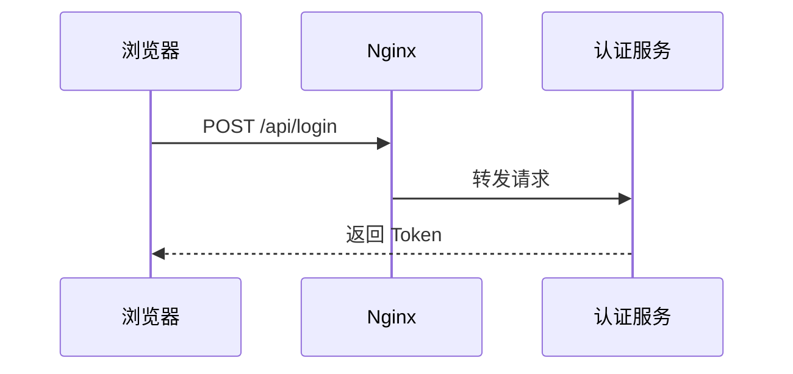
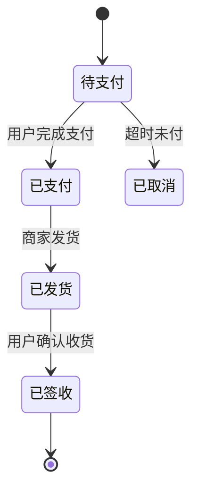

# Diagram —— 用图表直观表达，而不是堆文字

Kivio 的聊天能**直接把 ```mermaid 代码块渲染成图、把 ```html 代码块渲染成可交互预览**。
所以当一件事「画出来比写出来更清楚」时，优先出图，而不是大段文字描述。

## 何时主动画图

用户在讨论以下内容时，默认配一张图（不必等用户明确说"画图"）：

- 系统架构 / 模块关系 / 部署拓扑 → `flowchart` 或 `graph`
- 请求链路 / 调用时序 / 交互流程（"A 调用 B 返回 C"）→ `sequenceDiagram`
- 状态机 / 生命周期 / 审批流转 → `stateDiagram-v2`
- 数据库表关系 / 实体模型 → `erDiagram`
- 类 / 接口结构 → `classDiagram`
- 决策逻辑 / 分支判断 → `flowchart`（带菱形判定）
- 思维导图 / 知识拆解 → `mindmap`
- 时间计划 / 里程碑 → `gantt`
- 多方案对比 / 参数矩阵 → Markdown 表格（不是 mermaid）

一条回答里可以「先一句话结论 → 一张图 → 必要的补充说明」。

## 图必须紧凑、纵向、缩放后仍清晰（重要）

图会被缩放以适应聊天宽度——**横向铺得越宽，缩放后节点越小越看不清**。所以生成时务必：

1. **纵向布局，不要横向铺开。** 流程图/决策图开头写 `flowchart TD`（自上而下），**禁用 `flowchart LR` / `direction LR`**；状态机用 `stateDiagram-v2` 的默认纵向。让图往下长（占垂直空间没关系，纵向读着清楚），而不是往右拉成一长条。
2. **控制规模：单张图主干节点 ≤ 约 10～12 个。** 节点一多缩放后必然糊成一片。
3. **只画主干，砍掉枝节。** 把"超时取消、各种退款失败重试、人工介入"这类次要/边界分支**合并或省略**，详细规则放进**表格**或文字，不要每个边界情况都画成节点。一张图讲清主流程即可。
4. **拆图而非塞图。** 内容确实多 → 拆成多张小图（如"主流程"一张 + "退款子流程"一张），每张都小而清晰；绝不把所有情况堆进一张大图。
5. 自检：想象这张图缩到聊天框宽度，节点文字还看得清吗？看不清就说明节点太多/太宽，回头精简。

> 反面教材：一个订单状态机把"待支付/已支付/备货/发货/运输/签收/各种退款分支/重试/人工介入"十几二十个状态全画进一张横向图——缩放后全糊。正确做法：主流程只画 `待支付→已支付→已发货→已签收→已完成` 五六个核心状态（纵向），退款等异常单独一张图或用表格说明。

## 输出方式

直接在回答里写 fenced 代码块即可，应用会自动渲染，**不要调用任何文件/写入工具**：

````

````

## Mermaid 语法安全（Kivio 用 securityLevel: strict，必须遵守，否则整张图报红或画歪）

1. **禁用 `<br>` 和 `<br/>`（两种都禁），禁止任何文字里出现尖括号 `<` `>`。**
   strict 模式会拦截/转义它们。需要换行 → 拆成多条消息或多个节点；要表达"令牌"写 `accessToken`、`Bearer token`，**不要写 `<accessToken>`**。
2. **mermaid 语法位只用半角 ASCII 标点。** stateDiagram-v2 的转移标签、gantt 的任务定义，分隔符必须是**半角 `:`**（如 `待支付 --> 已支付: 用户完成支付`），**绝不能用全角 `：`**——全角冒号不会被当成分隔符，会被并进状态名导致图散架。全角中文标点 `：（）` 只允许出现在双引号包起来的展示文字里。状态机里同一个状态名前后要写法一致（别一会 `已支付` 一会 `已付款`）。
3. **classDiagram 成员保持最简**：`+area() float`、`-radius float`、`+name(p type) ret`。**禁止给成员加引号尾注**（`area() float "抽象方法"` 是非法的）；要表达抽象用类级 `<<abstract>>` 注解，别在成员后塞说明文字。
4. **sequence 消息禁塞 JSON / 多行 / 字段列表**（带 `{}` 的长串），消息写一句话短句；结构体、参数列表、长说明放到 `Note over A,B: ...` 里，或省略。
5. **文字含空格、括号、冒号、引号、`/`、中文标点时用双引号包**：`A["用户：点击登录 (首次)"] --> B["校验"]`。
6. **不要用 `click` 交互、不要嵌 `<script>`**（strict 禁用，会报错）。
7. 第一行必须是合法图类型声明（`flowchart TD` / `sequenceDiagram` / `stateDiagram-v2` / `erDiagram` / `classDiagram` / `mindmap` / `gantt`）；节点 id 用字母数字（`auth_svc`），中文/含空格的展示文字放进 `["..."]`，别直接拿中文当 id。
8. 拿不准的高级特性就用最基础写法，**能渲染 > 花哨**；宁可图简单配一两句文字，也不要塞太满导致语法出错。

正例（短消息、半角 `:`、无 `<br>`、无尖括号、无 JSON）：

````

````


## 需要交互 / 动画 / 自定义绘制时 → 内联 ```html（不要写成文件）

mermaid 画不了的（动画、canvas 绘图、可点击的自定义可视化、带样式的仪表盘卡片等），
**直接在回答里内联输出一个自包含的 ```html 代码块**（含内联 `<style>` 和 `<script>`），Kivio 会在预览框里真执行、当场就能交互：

````
```html
<!doctype html><html><body>
<canvas id="c" width="400" height="300"></canvas>
<script>/* 用 JS 在 canvas 上绘制 */</script>
</body></html>
```
````

**重要：不要把交互演示写成文件。** 除非用户明确说"保存 / 下载 / 生成 .html 文件"，否则**不要调用 write_file 等工具**把 HTML 落盘——写成文件只会变成一张下载卡片，用户还得另外用浏览器打开；而内联 ```html 会直接在聊天里渲染并可交互。要点：HTML 自包含（不依赖外部 CDN 更稳），canvas 必须配 JS 才会画出内容。


## 原则

- 能用图讲清的结构/流程/关系，就别用纯文字。
- 图是辅助，不是替代：图 + 一两句关键说明，比只给图或只给文字都好。
- 优先 mermaid（轻、可读、可复制源码）；mermaid 表达不了再上 html。
